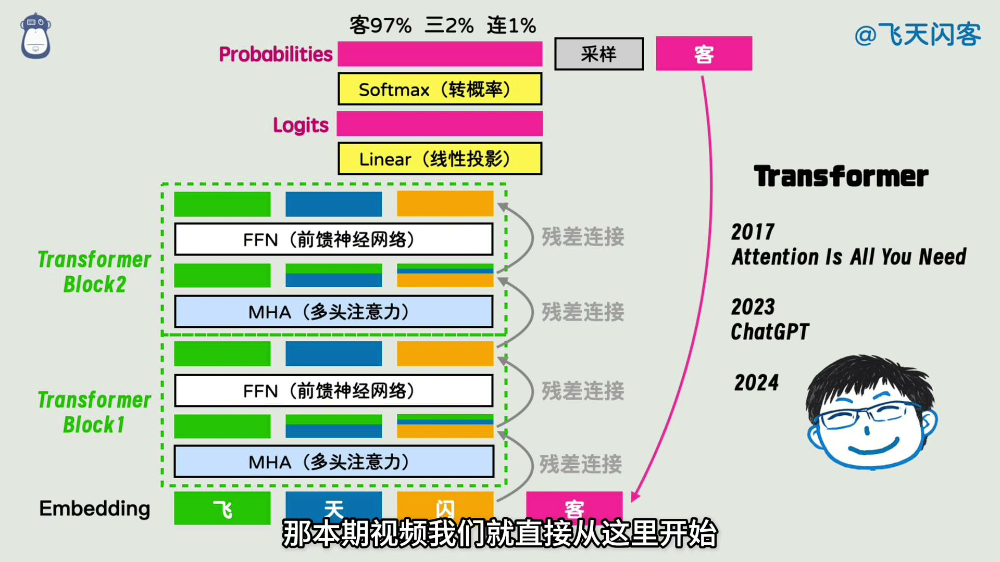
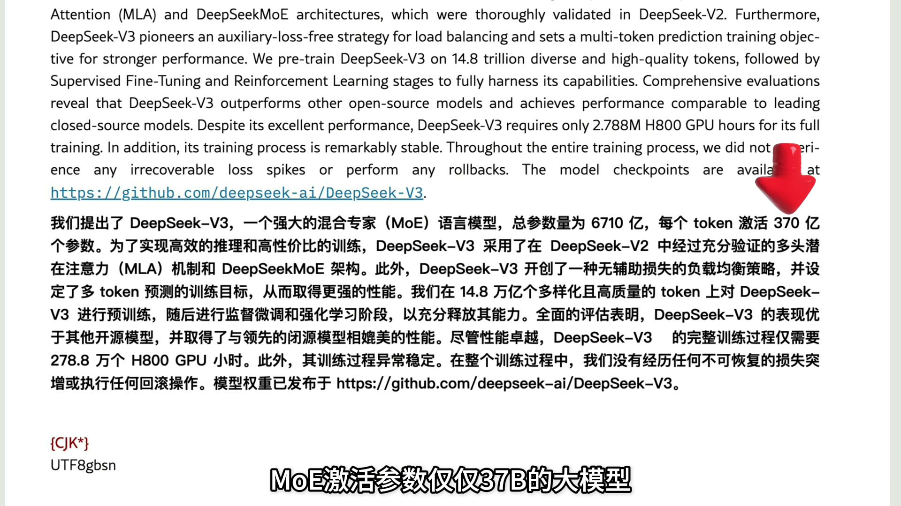

# DeepSeek-V4 技术解读（初稿）

> 来源:B站视频《深入解读 DeepSeek V1~V4》(@闪客) + arXiv 2606.19348 论文 + DeepSeek-V4 技术报告
> 日期:2026-08-04
> 本稿为视频优先的原始笔记,精修版见 note.md

## 一、视频主线:V1 → V4 的技术演进

视频用"成为梁文峰"的视角,把 DeepSeek 从 V1 到 V4 的每次架构改动串成一条技术路线。演进时间线:

| 版本 | 年份 | 核心贡献 |
|---|---|---|
| DeepSeek LLM (V1) | 2024 | 缩放定律与超参数研究 |
| DeepSeek-V2 | 2024 | DeepSeekMoE + MLA(压缩 KV) |
| DeepSeek-V3 | 2024 | 671B MoE / 37B 激活,低成本训练 |
| DeepSeek-R1 | 2025 | 纯强化学习(GRPO),Aha moment |
| DeepSeek-V3.2 | 2025 | DSA 稀疏注意力 |
| DeepSeek-V4 | 2026 | CSA + HCA,1M 上下文 |

1. **Transformer 基础**:embedding(词变向量) → MHA 多头注意力(加权求和,权重来自 Q·K) → FFN 前馈网络 → 残差连接 → 线性投影 → softmax 概率 → 采样。每循环一次是一个 transformer block。
2. **V1(DeepSeek LLM,2024-01)**:先研究 **scaling law**(缩放定律),补全超参数设置的影响(batch size、学习率、数据量、算力),为后续模型扩张与超参选择打理论底子;顺手训练第一个模型,开启"长期主义"路线。
3. **V2**:两个关键创新 ——
   - **DeepSeekMoE**:把 FFN 拆成多个专家,每个 token 只路由到部分专家,总参数量不变但单 token 计算量骤减;关键改良是**细粒度专家划分**(更多更小的专家)+ **共享专家**(每个 token 都访问)。
   - **MLA(多头潜在注意力)**:认为 KV 向量有冗余(类似图像可被 VAE 压缩),先把所有 token 的 KV 压缩成一个 latent,用时再还原,大幅降低 KV cache 占用。
4. **V3**:总参数 **671B MoE,激活 37B**,综合 MLA、DeepSeekMoE、多 token 预测(MTP)等工程优化,以极低训练成本和稳定过程达到比肩前沿模型的开源性能,社区开始广泛关注。
5. **R1**:做出"违背祖宗的创新"——用**纯强化学习(GRPO)**训练推理,**不用 SFT**:让模型自由发挥,答对奖励、答错惩罚。模型自发涌现推理,出现 "Aha moment"(输出中自我纠错),开创推理模型新范式。
6. **mHC(流形约束超连接)**:残差连接太死板 → 字节提出 HC(残差流拓宽、乘可学习矩阵)→ 连乘可能梯度爆炸 → 加流形约束让矩阵相乘始终可控 → 训练稳定,为超大规模模型铺路。
7. **V3.2 / V4**:
   - **DSA(DeepSeek 稀疏注意力)**:通过策略找相关 token,而不是定死滑动窗口。
   - **CSA + HCA**:把历史 token 压缩(类似 MLA),CSA 压缩后做稀疏注意力,HCA 更激进压缩但保持稠密注意力。
   - DSA 写进 V3.2,CSA/HCA 写进 V4。

结尾总结:**"最初的种子早在 2024 年 1 月 2 号的 DeepSeek LLM 就埋下了,两年后的 V4 只是来时路的总和。"** —— MLA 证明"KV 可压缩",DSA 证明"attention 可稀疏",V4 把两者合成 CSA 再加 HCA。

*↑ 120s:技术演进主线开场*

*↑ 390s:V3 671B 展示画面*

## 二、论文核心信息(arXiv 2606.19348)

### 模型规格

| 模型 | 总参数 | 激活参数 | 预训练数据 | 上下文 |
|---|---|---|---|---|
| DeepSeek-V4-Pro | 1.6T | 49B | 33T tokens | 1M |
| DeepSeek-V4-Flash | 284B | 13B | 32T tokens | 1M |

**关键指标**:V4-Pro 在 1M 上下文下推理 FLOPs 只需 V3.2 的 27%、KV cache 只需 10%;V4-Flash 更极致(10% / 7%)。路由专家权重用 **FP4 精度**,未来硬件理论上可再省 1/3 算力。

### 三大架构升级

1. **混合注意力(CSA + HCA)**:解决长上下文下注意力 O(n²) 的算力瓶颈。
   - **CSA(Compressed Sparse Attention)**:先把每 m 个 token 的 KV 压缩成 1 条,再做 DSA 稀疏注意力(query 只 attend 到 top-k 条压缩 KV),外加滑动窗口保留局部细节。
   - **Lightning Indexer**:CSA 的稀疏选择由轻量索引器完成——复用压缩算子生成压缩后的 indexer keys,以低秩方式(先降维再升维)为每个 query 生成多条 indexer queries,选出 top-k 条参与核心注意力;其 QK 路径在推理/后训练中以 FP4 运行,加速长上下文注意力分数计算。
   - **HCA(Heavily Compressed Attention)**:更激进的压缩,每 m'(≫m) 个 token 合并成 1 条,但保持稠密注意力,承担"全局概况"角色。
   - CSA 与 HCA **交错布置**:局部细节由滑动窗口捕捉,长程结构由 HCA 兜底。
2. **mHC(Manifold-Constrained Hyper-Connections)**:把残差映射矩阵 B 约束到**双随机矩阵流形(Birkhoff 多面体)**——行和、列和都等于 1 的非负矩阵。约束后谱范数 ≤1、映射非扩张、对乘法封闭,深层堆叠数值稳定;投影用 Sinkhorn-Knopp 迭代(20 次)。**动态参数化**:三个映射由输入经低秩投影 W^pre/W^res/W^post 生成,叠加静态偏置后投影到流形。
3. **Muon 优化器**:V3 用 AdamW,V4 大部分模块换 Muon(牛顿-舒尔茨迭代的矩阵级优化器),momentum 0.95、wd 0.1、RMS 重标至 0.18;收敛更快、训练更稳。

### 预训练与后训练

**预训练**:语料 >32T tokens(Flash 32T / Pro 33T),网页数据过滤模板化内容防模型坍缩,数学/编程为核心,中期引入 agentic data,强调长文档(论文/技术报告);词表 128K,序列长度 4K→16K→64K→1M 渐进,前 1T tokens 用稠密注意预热再引入稀疏注意。稳定性靠 **Anticipatory Routing**(路由索引用历史参数提前算,开销约 20%)+ **SwiGLU Clamping**(线性分量截断 [-10,10])。

**后训练**:两阶段——**领域专家独立训练 → on-policy 蒸馏(OPD)合并**。
- 专家训练:各领域 SFT + GRPO;三档推理模式(Non-think / Think High / Think Max);难验证任务用**生成式奖励模型(GRM)**(actor 原生充当评判者);工具调用用 `|DSML|` + XML schema;Interleaved Thinking 在工具场景保留全部推理历史;Quick Instruction 复用 KV cache 降 TTFT。
- OPD 合并:统一 student 对 10 余个专家教师做 **reverse-KL 全词表 logit 蒸馏**,比逐 token KL 更稳定。

### 评测要点(V4-Pro-Max)

| 维度 | 表现 |
|---|---|
| 知识 | SimpleQA / 中文 SimpleQA 显著领先开源;MMLU-Pro / HLE / GPQA 小幅领先开源,紧追 Gemini-3.1-Pro |
| 推理 | 强于 GPT-5.2、Gemini-3.0-Pro;弱于 GPT-5.4、Gemini-3.1-Pro,**落后前沿约 3–6 个月** |
| Agent | 与 Kimi-K2.6、GLM-5.1 持平;内部评测强于 Claude Sonnet 4.5,接近 Opus 4.5 |
| 长上下文 | 1M 上下文下强,学术基准上超过 Gemini-3.1-Pro |

**基础模型对比**(部分基准):

| 基准 | V3.2-Base | V4-Flash-Base | V4-Pro-Base |
|---|---|---|---|
| MMLU-Pro (5-shot) | 65.5 | 68.3 | 73.5 |
| SimpleQA-verified (25-shot) | 28.3 | 30.1 | 55.2 |
| SuperGPQA (5-shot) | 45.0 | 46.5 | 53.9 |
| FACTS Parametric (25-shot) | 27.1 | 33.9 | 62.6 |
| HumanEval (Pass@1) | 62.8 | 69.5 | 76.8 |
| LongBench-V2 (1-shot) | 40.2 | 44.7 | 51.5 |

Flash-Base 以更小参数量全面超 V3.2-Base;Pro-Base 进一步全面领先,SimpleQA/FACTS 上近乎翻倍。

## 三、开源资源

作为 preview,V4 的定位是**把百万级上下文变成常规部署成本可承受的能力**——让长程 Agent、跨文档分析、test-time scaling 变得切实可行。权重已开源,HF[4] 与 ModelScope[5] 共收录 7 个模型:

| 模型 | 参数量 | 说明 |
|---|---|---|
| DeepSeek-V4-Flash-Base | 292B | 基础版 |
| DeepSeek-V4-Flash | 291B | 文本生成 |
| DeepSeek-V4-Pro-Base | 1.6T | 基础版 |
| DeepSeek-V4-Pro | 1.6T | 文本生成 |
| DeepSeek-V4-Flash-DSpark | 165B | 稀疏版 |
| DeepSeek-V4-Pro-DSpark | 1.7T | 稀疏版 |
| DeepSeek-V4-Flash-0731 | 304B | 快照版本 |

- HF 集合:https://huggingface.co/collections/deepseek-ai/deepseek-v4
- ModelScope 集合:https://modelscope.cn/collections/deepseek-ai/DeepSeek-V4

## 四、观众观点(视频弹幕+热评)

弹幕高频词:token、moe、DeepSeek、R1、transformer、毕导、夯爆了、有惊喜有突破。

- "从 V1 到 V4……满本上都写着两个字 '没卡'" —— 调侃缺算力,反而点中 V4 的本质(513 赞)
- "仍然用古法阅读和古法 PPT 绘图的方式制作出如此高质的视频" —— 认可 up 主认真(402 赞)
- "极少数硬核的 up……出淤泥而不染"(343 赞)
- "闪客不愧为小梁文峰"(280 赞)
- "感觉 dp 的热度比去年下降了好多……对比这几家还有优势吗?"(130 赞)—— 竞争格局真实感知
- "周日赶项目 opus4.7 没解决的问题 v4pro 三轮解决了"(119 赞)—— 一线使用反馈
- "v4 又降价了,缓存命中一折"(23 赞)—— 价格策略
- "有传言说 V4 放弃了 CUDA 架构,转用昇腾 GPU"(34 赞)—— 未证实传闻,存疑

## 五、参考文献

[1] DeepSeek-AI. DeepSeek-V4: Towards Highly Efficient Million-Token Context Intelligence[EB/OL]. arXiv:2606.19348, 2026. https://arxiv.org/abs/2606.19348

[2] DeepSeek-AI. DeepSeek-V4 Technical Report[EB/OL]. Hugging Face, 2026. https://huggingface.co/deepseek-ai/DeepSeek-V4-Pro/blob/main/DeepSeek_V4.pdf

[3] DeepSeek-AI. DeepSeek-V4 发布公告[EB/OL]. 微信公众号, 2026. https://mp.weixin.qq.com/s/8bxXqS2R8Fx5-1TLDBiEDg(抓取时需微信验证,未能直接读取)

[4] DeepSeek-AI. DeepSeek-V4 Models[EB/OL]. Hugging Face Collection. https://huggingface.co/collections/deepseek-ai/deepseek-v4

[5] DeepSeek-AI. DeepSeek-V4 模型集合[EB/OL]. ModelScope. https://modelscope.cn/collections/deepseek-ai/DeepSeek-V4

[6] 闪客. 深入解读 DeepSeek V1~V4!男女老少都听得懂[EB/OL]. Bilibili, 2026. https://www.bilibili.com/video/BV1rpovBCEGH/
