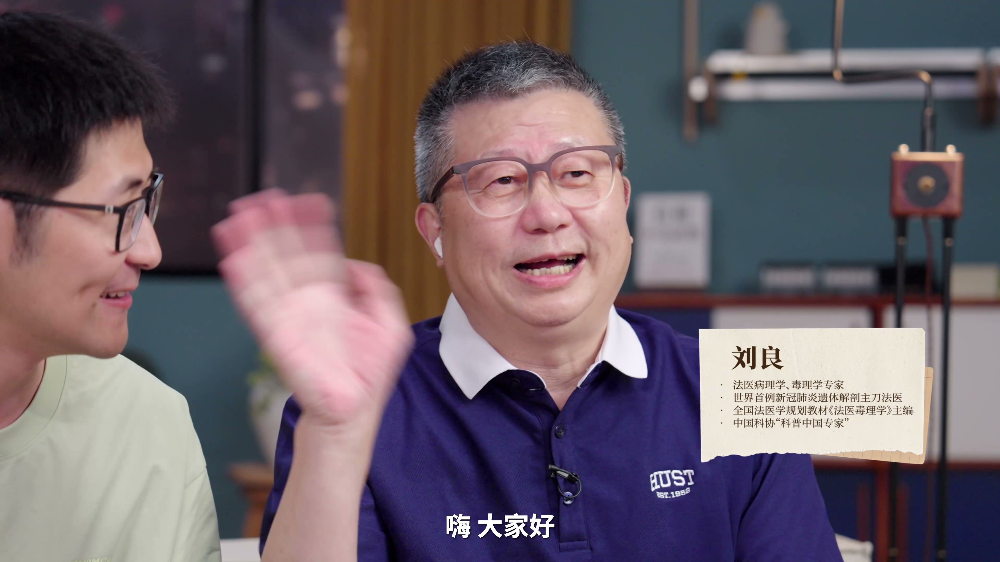
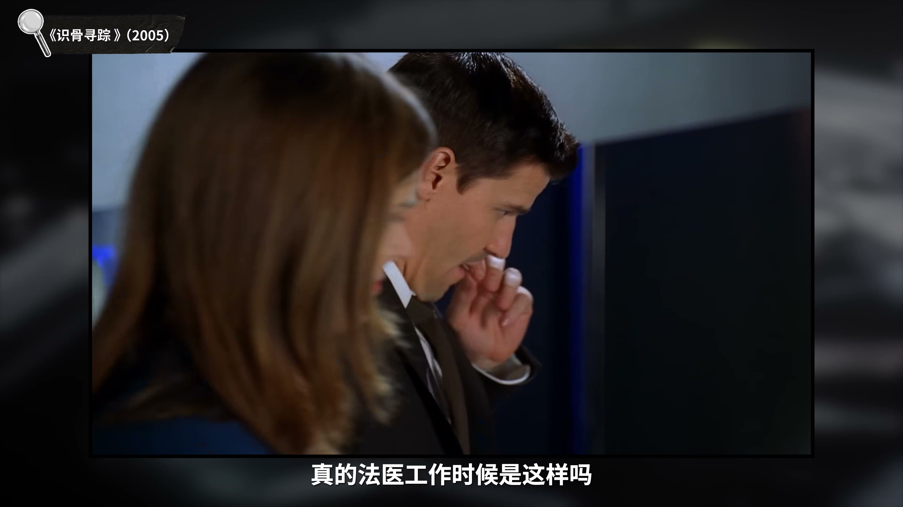
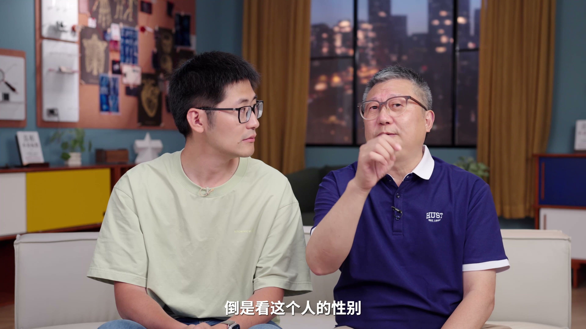
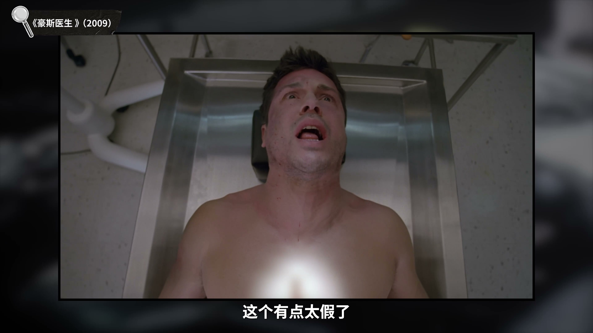
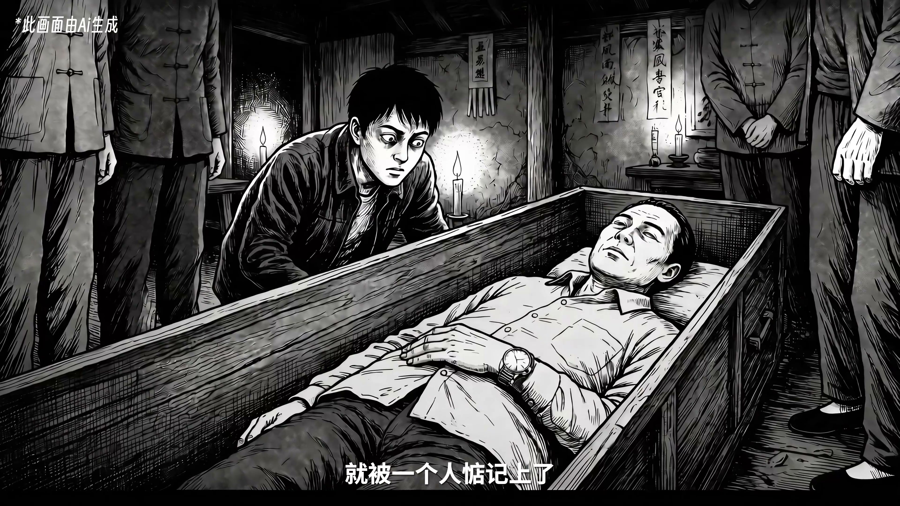
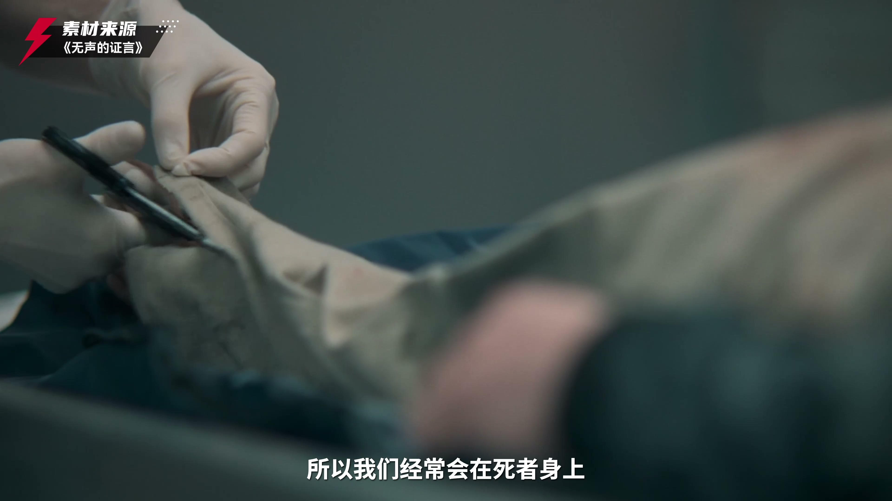
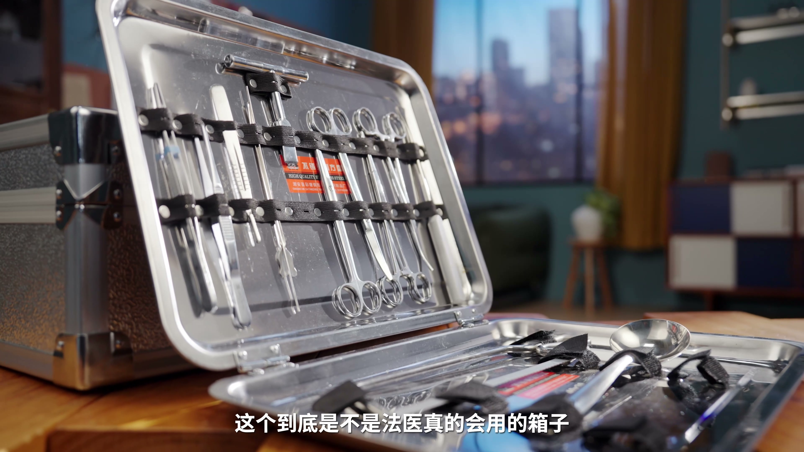
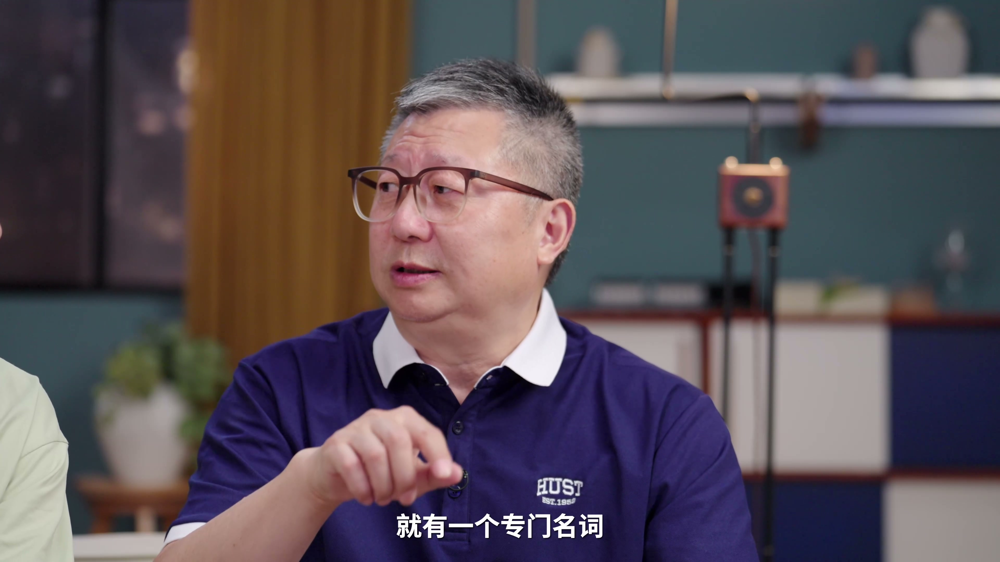
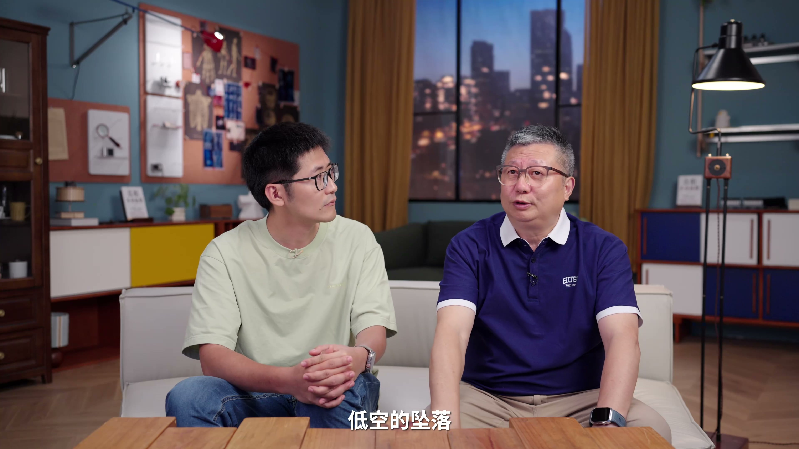

> 来源链接：https://www.bilibili.com/video/BV1QEgZ6rEGj/

## 1. 专家介绍与法医工作初探

本期视频邀请了从业43年、主刀解剖遗体4000余例、参与解剖1万余例的资深法医刘良老师，通过拉片经典影视作品，对比分析真实法医工作的细节。

影视作品中常出现不戴口罩进行尸体检查的场景，刘良老师指出这在现实中是不真实的。法医在现场工作必须佩戴口罩，不仅是为了卫生，也是为了应对强烈的尸臭。

*   **尸臭的记忆性**：法医解释，尸臭具有极强的嗅觉记忆。离开现场后，即使经过反复清洗，人体仍会产生“身上残留臭味”的错觉。应对方法通常是闻更为刺激的粪便气味，利用熟悉的臭味来“覆盖”和遏制这种不属于日常的尸臭。

## 2. 尸体检查的科学依据

关于影视剧中一眼判断死者年龄和身份，刘老师表示：
*   **年龄判定**：主要依据骨骼长短及X光片中的骨骼发育情况，需通过特定函数测量，不能仅凭肉眼判断。
*   **性别判定**：可以通过骨盆形态快速辨别。女性骨盆下口呈喇叭形，而男性骨盆下口开口较小。

影视剧中常出现用电锯开刀的场景，刘老师指出该工具（开颅电锯）的特性是“吃硬不吃软”，仅对骨骼有效，无法切割人体软组织，因此剧中的使用方式往往夸大了其效果。

## 3. “诈尸”与超生反应

刘老师分享了真实的案例：曾有被电击后被误认为死亡并埋葬的人，因手表被盗掘者撬开棺材，结果被发现眼珠仍在动且坐了起来。
*   **超生反应**：人即使心跳呼吸停止，组织细胞在短期内并未完全死亡，受到刺激仍可能产生收缩或运动反应，这在火化等处理过程中可能发生，并非真正的“复活”。

## 4. 痕迹检验与家暴警示

法医在勘查现场时，会重点搜集死者指甲、头发及衣物内的矿物质、盐分等微量物证，以判定是否为“第一现场”。
*   **损伤分析**：刘老师通过观察主持人的淤青，精准判断出其损伤时间约为三天以上，并指出反复出现的黄、红、紫色淤青往往是家暴或虐待的信号。
*   **警示**：对于家暴，必须立刻拍照取证并报案，任何一次的纵容都可能导致更严重的伤害。

## 5. 法医工具箱揭秘

刘老师展示了真实的法医勘查箱：
*   **汤勺**：用于收集胸腔或腹腔内的积血，以便测量出血量。
*   **凿子与扩张器**：用于辅助开颅。头皮与颅骨粘连紧密，需用凿子剥离；开颅锯开后，利用扩张器插入缝隙并用力撬开，听到“咔嚓”声即说明成功。

## 6. 尸体痉挛与分尸鉴定

*   **尸体痉挛**：当人遭遇极度突发性死亡（如自杀开枪）时，手部肌肉会瞬间紧绷并保持姿势，无法松开，这被称为尸体痉挛。
*   **分尸案件**：法医有责任将尸块拼凑完整，通过观察断面是骨干断裂还是关节损伤，可以推断凶手是否具备屠夫或医生的职业背景。

## 7. 死亡的脆弱与健康建议

*   **低空坠落的危险性**：坠落伤往往表现为“外轻内重”，表面可能仅有一个肿包，但内部血管可能已破裂。若不及时就医，一小时内即有生命危险。
*   **猝死警示**：现代年轻人熬夜、过度劳累且忽视体检，身体在长期的透支中会发生不可逆的变化。刘老师郑重建议：一定要定期进行体检，生命比想象中脆弱。

## 8. 观众观点

*   **对尸臭的共鸣**：评论区有专业人士提到，处理腐败遗体时那股味道确实会印在脑子里，甚至产生幻觉，认同刘老师关于嗅觉记忆的描述。
*   **文化差异讨论**：有观众指出中美法医工作习惯（如是否戴口罩）存在差异，但这并非技术高低之分，而是国内对法医职业保护和现场规范做得更加到位。
*   **法医的意义**：观众普遍认为法医是“为死者开口说话”的职业，充满了人文关怀与积德的意义。
*   **反馈与纠错**：对于分尸案中“拼凑尸体”的细节，观众通过弹幕补充了清理现场（如收集蛆虫推断时间）等更为细致的刑侦知识。