> 来源链接：https://www.bilibili.com/video/BV1c54y187SH/

> 讲师：刘洪波（学为贵创始人、雅思真经派创立者，被雅思官方及媒体称为"雅思教父"）。本课是《雅思真经》第一课，刘洪波自述是"送给全球雅思考生的礼物"，全程围绕"听说读写四科如何考、如何应对"展开，并给出正确备考计划。

## 1. 雅思备考的核心理念与误区

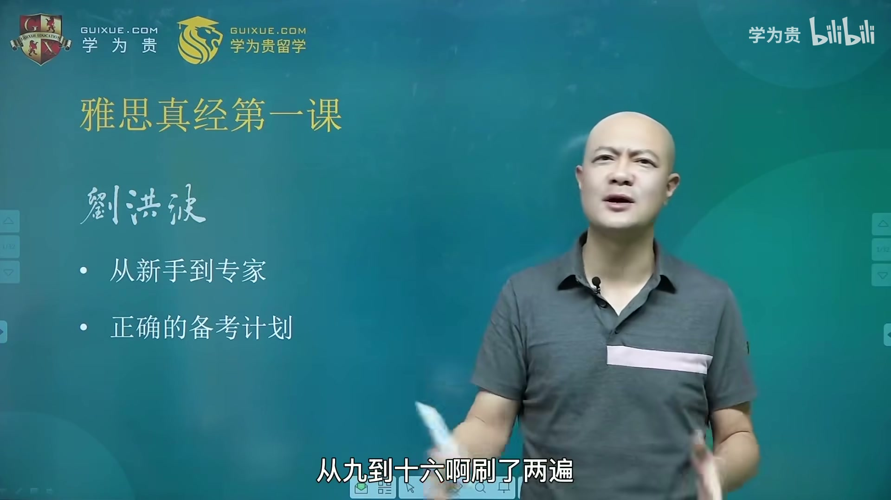
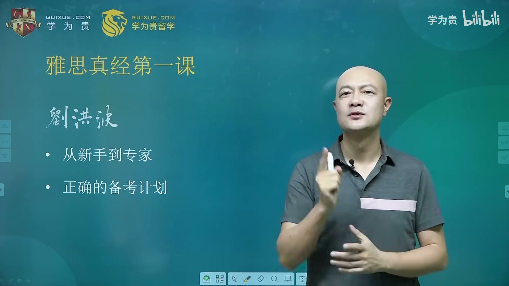

刘洪波开篇点明：很多考生"备考很久，分数在 5.5 分左右晃荡，翻来覆去爬不出来"，根源不是不努力，而是方法走偏。他用两个最常见的坑说明问题。

### 1.1 刷题是模考，不是学习
*   常见场景：很多同学"剑桥雅思真题从 9 到 16 刷了两遍，为什么分数没有提高？"
*   刘洪波的回答："当然没有提高，就是因为你刷了两遍。"因为**刷题的本质是模考，是用来测试当前水平的**。
*   金句："一测 5.5，我不相信，我再刷，还真是 5.5。""刷了两遍之后，你会把你的 5.5 刷得越来越稳定，上了考场一定 5.5，不会提高也不会下降。"
*   结论：基础能力没有提升之前，盲目刷题只是把现有水平"练得更稳定"，无法带来分数跨越。

### 1.2 背单词不是目的
*   常见误区：一上来先背"雅思 7000 词汇量"，上考场发现"阅读好像读得懂，词汇量大了，但一做题正确率还是不高"。
*   原因：雅思要的是**特定语境下的反应速度**，而不是单纯的视觉认知。词汇量大但"调取不出来"，等于"英雄无用武之地"。

### 1.3 这门课的分量（老师自述）
*   雅思官方曾邀请中国各大培训机构掌门人到剑桥与命题方研讨，要求每人写一篇学术论文评比，**刘洪波得了唯一的第一名**。
*   雅思官方平台公开课创下历史最高观看人数，平台容量不够还临时扩容。
*   当当网当天雅思教材销量排行前十名中，他的书占 7 本（前五名被学为贵包揽）。
*   学为贵成立那年（10 年前），一名小学生考出雅思 7 分，被新浪称为"当年中国小学生的最高雅思成绩"。

---

## 2. 雅思听力备考真经

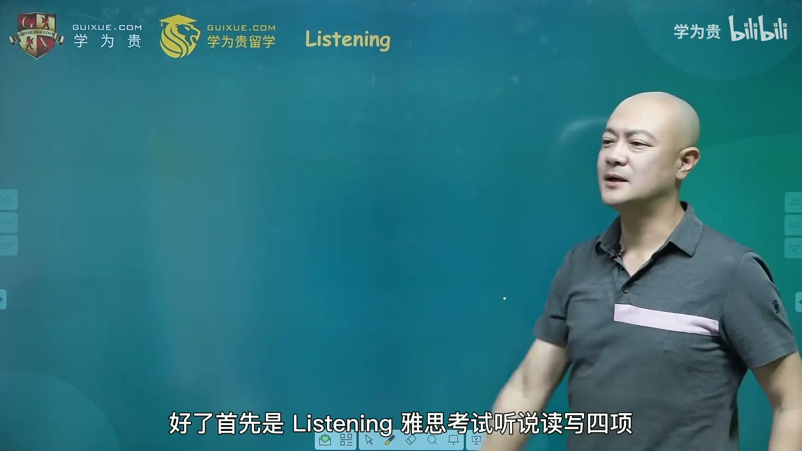
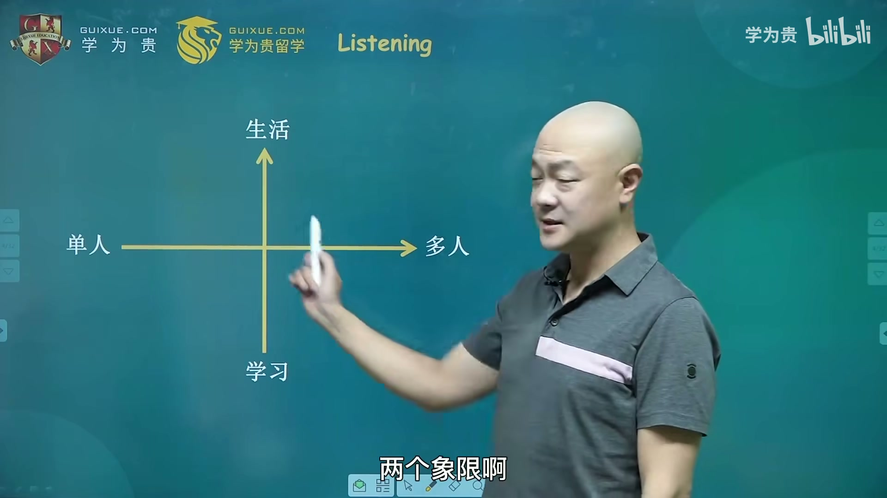

### 2.1 考试设计：两个坐标轴理解四个 Section
真经派用**"单人/多人"×"生活/学习"**两个坐标轴来理解听力设计，每个 Section 10 道题：
*   **Section 1**：生活场景 + 两人对话（如出国后的日常咨询）。
*   **Section 2**：生活场景 + 单人独白（如导游介绍"今天带大家去莎士比亚故居"）。
*   **Section 3**：学习场景 + 多人讨论（通常是两个同学和一个老师讨论作业）。
*   **Section 4**：学习场景 + 单人授课（教授上课片段，"天文地理物理化学都可能"）。

为什么不是 3 个也不是 5 个 Section？刘洪波强调：这恰好覆盖了留学生在国外的全部听觉场景——**一个人讲话、两个人对话、多人讨论，外加生活类与学习类**，设计非常科学。

### 2.2 送分 Section：Section 1 和 Section 3 可以提前预测
两大场景话题相对固定，考前就能准备，属于"送分题"：
*   **Section 1 高频生活场景**：旅游（机场、火车站、景点）；咨询（住房、俱乐部、培训班、考试、工作）；银行；医疗（就医、买保险）。
*   **Section 3 高频校园场景**：图书馆学习、论文作业讨论、考前复习预习。
*   核心词如 `seminar`、`lecture`、`similar`、`internship`，提前背熟，难度直线下降。
*   预测把握："你 90% 以上的概率会碰到这几大场景。"
*   而 **Section 2 和 Section 4 无法预测**（导游讲什么、教授讲什么都有可能）。

### 2.3 中国考生的三大听力问题
1.  **听不懂**——根本不知道在讲什么；
2.  **听懂了但听不到出题点**——不出题的地方都听明白了，出题那一下反而错过；
3.  **听懂了也听到了考点，但写不对答案**——雅思听力有拼写填空题，不只是 ABCD。

### 2.4 解决"听不懂"：精听跟读法
*   老师用单词 `environment` 做现场测试，把学生分四类：
    1.  觉得好熟，但要想一下才想起"环境"；
    2.  瞬间反应出中文"环境"；
    3.  **（最佳）**听到 `environment` 就像听到 `and`、`but`、`because` 一样直接反应，不需要翻译——"没有中文的感觉，但知道它直接指代什么"；
    4.  没背过，反而能靠上下文猜出大意。
*   最怕的是前两类：**视觉认识、听觉不敏感**。拿到听力原文阅读全懂，但听的时候"当场那个时刻要迅速反应"，反应慢就跟不上。
*   **泛听为什么没用**：每天听两小时英语新闻、做一套题，其实一直处在"听不懂—测试自己现有水平"的状态，没有去找问题、解决问题，只是"收获了英语听力提高的幻觉"。
*   **精听跟读的具体做法**：
    1.  一周只做一套听力题，刚开始甚至只做这套题的 **Section 1**；
    2.  先听一遍，记住"哪些地方没听懂"的感觉；
    3.  对着原文放音，把**反应滞后的单词画下来**（如 `organize`、`lecture`、`professor`、`similar`、`different`、`variety`、`expert`、`priority`、`optimistic`）；
    4.  把画下来的单词**大声读 20 遍**，直到它变成 `and` 的级别、直接进入潜意识。
*   量化目标：一天搞定 50 个这样的单词，一个月能把 1000 多个高频核心词变成"and 级别"——"再去听雅思听力，他说什么你都跟得上。"

### 2.5 解决"听不到出题点"：考点词与同义替换
*   **真题例 1**：卷面上是 `students must take ___`（no more than two words），很多同学死等 `must`、`take` 两个原词，结果原文说的是 **`You are required to bring two photos`**。
    *   `must = have to = be required to = need to do`；
    *   `bring = take`，答案是 `two photos`。
*   为什么反复考命令式？因为出国后学生、员工、患者都要面对老师的指令、老板的要求、医生的嘱咐、银行的提醒，"别人对你的要求很多时候是极度重要的，听不懂就干不成事"，所以官方认为你必须听懂。
*   **真题例 2**：`airport shuttle`（机场穿梭巴士，象声词）。
    *   考点：`reserve = book`。原文 "you need to reserve a seat"，填空写 `book` 或 `reserve` 均可；
    *   联想记忆：`shuttle` 把双 `t` 换成双 `f` 就是 `shuffle`（洗牌），再加前缀 `re` 变成 `reshuffle`（企业改组），是阅读考点词。
*   **真题例 3**：假期保险选择题（较难的理解题）。
    *   原文 "If you haven't organized any insurance policy of your own... you need to take out the low cost cover we offer, and **we require** that you arrange this **when you make your holiday reservation**"；
    *   考点叠加：`require = must`、`reservation = booking`、`this` 指代 `take out`（买保险）。
*   **考点词理论**：听力里一共 **179 个**高频考点词，`reserve = book` 是最高频的一个（"学雅思听力，第一个要背的单词就是 reserve"）。
*   金句："不要告诉我雅思 7000 词汇量，在我们真经派看来，最核心的是先搞定这 179 个。你对它敏感了，就不会出现听不懂、听不到答案的问题。"
*   附加高频词：`toxic`（有毒的，同义词 `poisonous`），听力阅读都反复考，是老师全国巡讲的"送书词"。
*   每个考点背后都映射国外留学的真实语用场景——这也是雅思"全球认可、最流行的测试"的原因。

### 2.6 解决"写不对"：语料库
*   拼写犹豫（`photo` 加 `s` 还是 `es`？）靠刷**《雅思王听力真题语料库》**（王璐老师）解决，里面都是真实考题的答案词汇。
*   两大原创理论 + 一套语料库，分别对应三大问题：**考点词理论 / 同义替换理论（179 词）解决"听不到"，《雅思王听力语料库》解决"写不对"**，两本真经教材聚焦"听不懂"（把剑桥真题里的难词挑出来精听跟读）。

### 2.7 提分预期
*   用对方法、够努力，**一个月听力提高 2～2.5 分是常见现象**。
*   判断方法是否正确的标准：努力了一个月还是没提高，"只能证明一个问题——方法错了"。

---

## 3. 雅思阅读备考真经

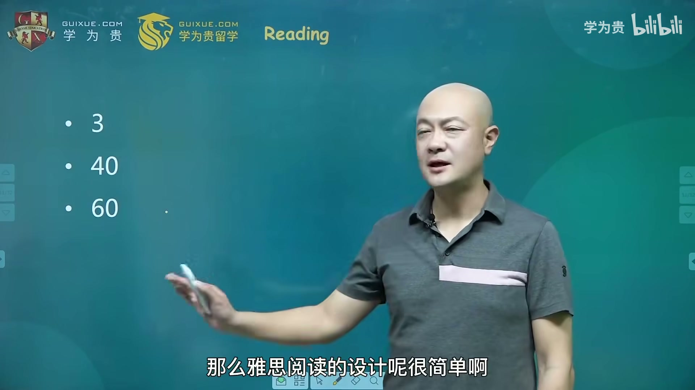
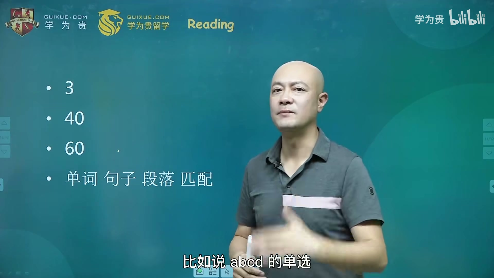

### 3.1 考试结构与四大题型
*   三篇文章，每篇约 1000 词，共 40 题（每篇约 13 题），60 分钟，时间压力大。
*   四大题型：
    1.  **填单词题**：summary、填图题、回答问题——只要写单词都算一类；
    2.  **句子理解题**：true/false/not given 判断、ABCD 单选（单选本质是判断哪句是原文的 true 表达）；
    3.  **段落中心思想题**：List of Headings；
    4.  **乱序匹配题**："连连看"，很多考生最痛苦。
*   口诀：**"两种题后做，优先细节题"**——反对其他流派"先做 heading 题"的做法。有考生照做后"15 天涨了 1.5 分"。

### 3.2 考点词理论：538 个核心词
*   阅读把庞大的词汇量浓缩为 **538 个考点词**，第一个要背的是 `resemble`（= `like` = `look like`）。
*   真题验证：不管题型是填空、判断还是填图，不管主题是金字塔考古、外星人还是机械，**考点翻来覆去都是那一个**——`resemble`、`reserve` 这类词。
*   真经派弟子考完回忆的都是"这次又考到 resemble / reserve"，而不是具体主题——"你能回忆出考点，这道题肯定做对了"。

### 3.3 真题拆解：一道题里的三个考点
*   例题：某科学家希望从一种可可产品中制造一种药。
    *   **同义词替换**：`hope to = attempt to`；
    *   **语法考点（同位语）**：`a cocoa western product` 是前面名词的同位语（"名词，逗号，名词"结构，两者划等号，类似"《西游记》，中国四大名著之一"）；
    *   **语法考点（指代）**：`the drug` 指代上文的 `Q`（即那种药材）。注意这种指代不是简单的 `it/this`，而是"对前文某个名词的另一种说明"，是考官爱设的出题陷阱。
*   方法论金句：做题不只是做对或做错，要"像老师讲课一样，去理解和欣赏考官的设计——他为什么要这么出题"。
*   老师还对比了环球、新航道、新东方三家机构对该题的解析，指出不同流派对雅思理解的深浅完全不同。

### 3.4 词汇记忆：反对乱序，提倡逻辑记忆
*   强烈反对乱序记单词："背完太阳背月亮，背完月亮背星星"——中文里从没人这么学，"逻辑记忆才是最高效的"。
*   反例金句："背完太阳背太太？你咋不上天呢，你咋不和太阳肩并肩呢。"
*   这也是《五维逻辑词汇记忆》的核心思路（详见第 6 节）。

### 3.5 潜意识记忆法与考点词扑克牌
*   剑桥雅思七第一套第三篇文章讲的是 **suggestopedia（暗示教学法 / 潜意识记忆法）**：一节课可记 1000 个单词，7 节课记 7000 个。
*   背后的脑科学现象："大脑不太听话，你想让它记得它记不住，你不想让它记的周边信息反而记得很深"（如记得看第一部动画片时的电视机大小、坐在哪个房间，却记不清动画内容）。
*   据此研发了**考点词扑克牌**：融合"潜意识记忆法 + 考点词理论"两大创新。用法不是背单词，而是**真的打扑克**（斗地主），打牌时无意扫到的考点词会进入潜意识，考场上被轻松唤起。
*   该扑克牌不对外售卖，只赠送给学为贵全国分校的真经派内门弟子。

### 3.6 阅读提分最快
*   阅读题型最复杂、文章最长、时间压力最大，但**"越复杂越有技巧，技巧就越管用"**，所以四科中阅读短期提分最快。
*   提分预期：**阅读提高 3 分是正常水平**（学为贵对老师的要求：学生没提高 3 分就不算体现真经派实力）。

---

## 4. 雅思写作备考真经

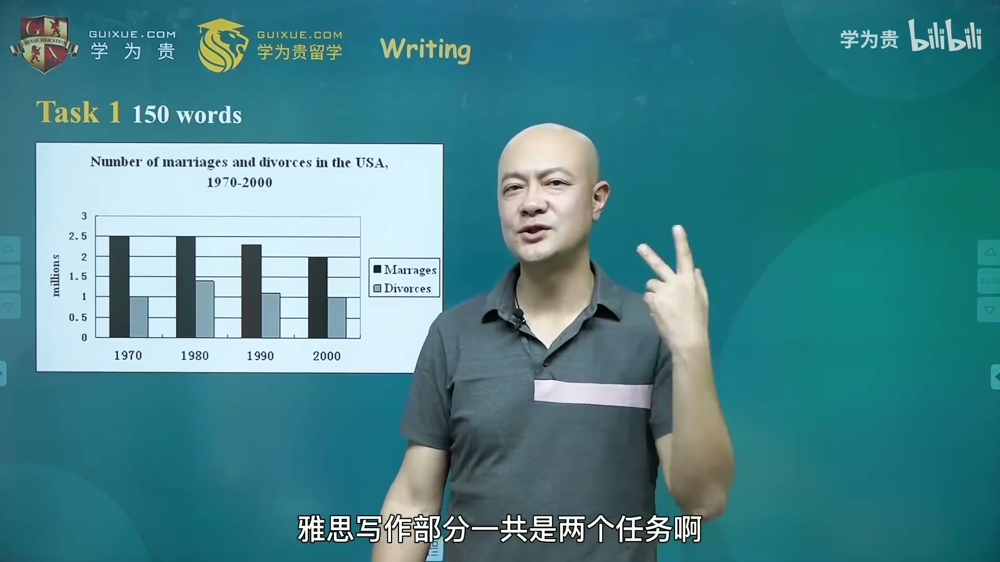
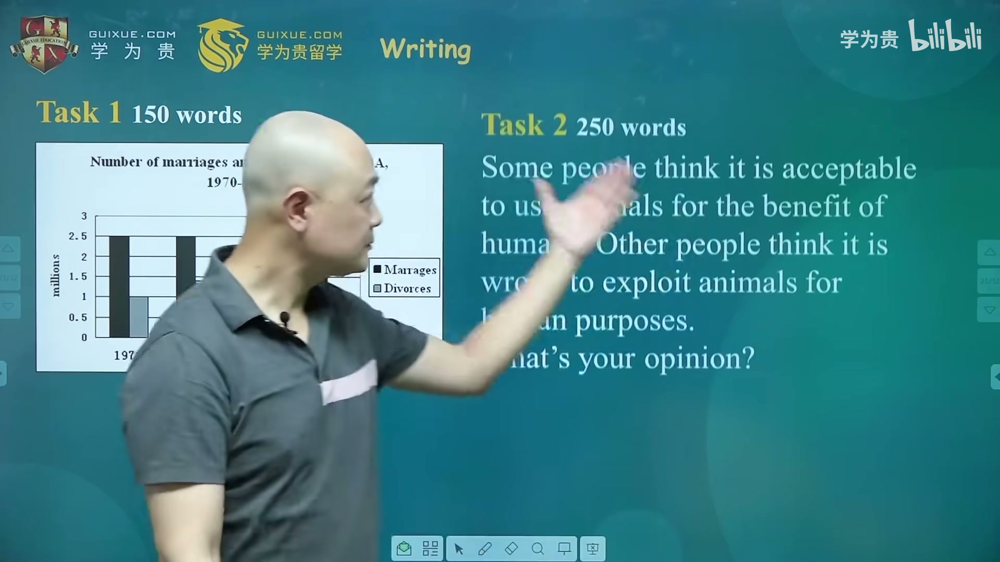
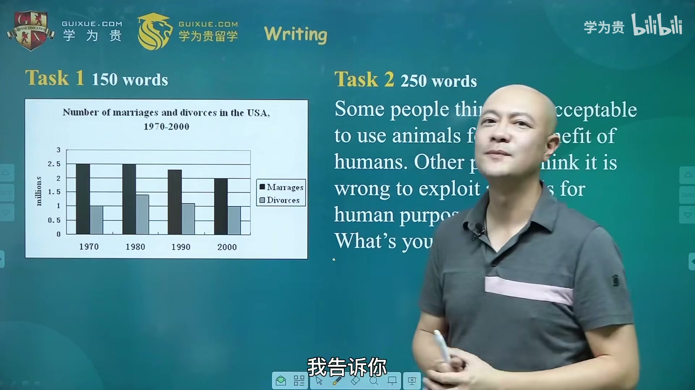
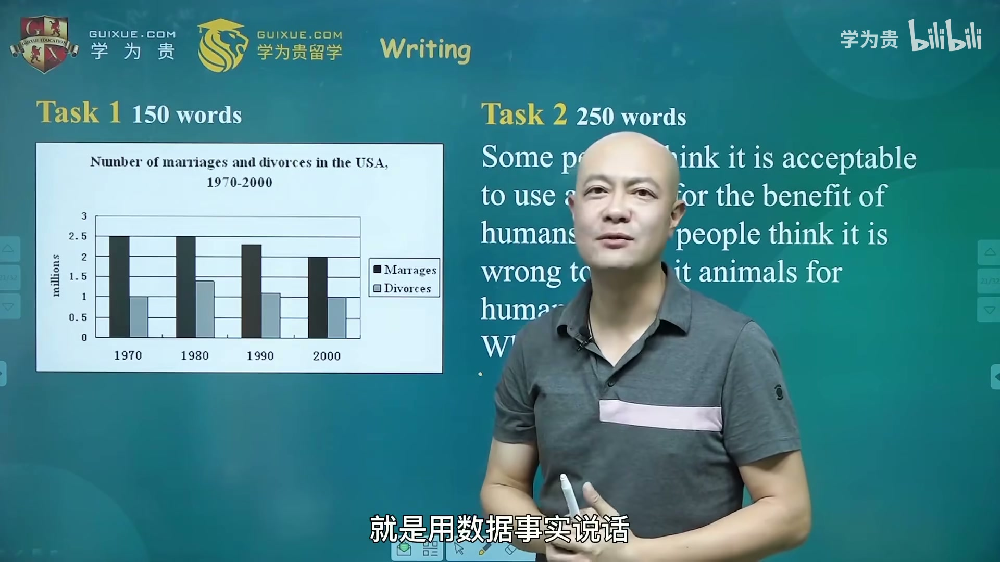
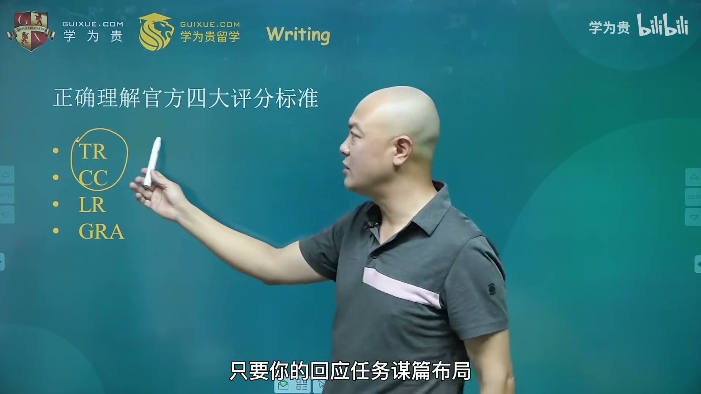
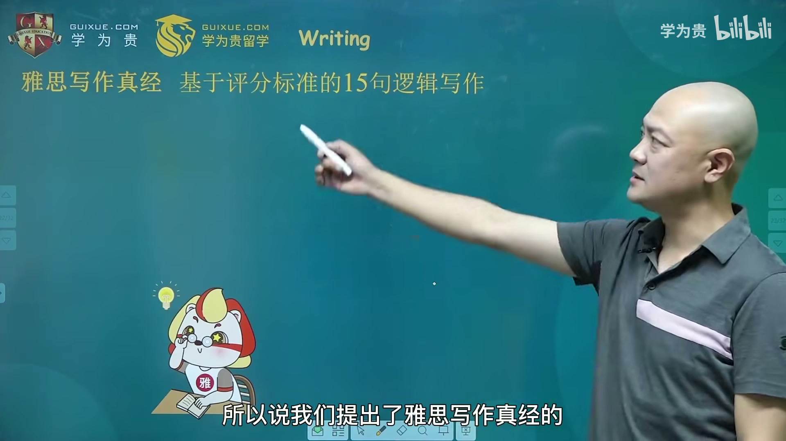

### 4.1 任务组成
*   **Task 1**：不少于 150 字，数据图表描述（线图、饼图、柱状图、表图），写"特点、趋势、对比"。口诀诗：**"线表明柱，心中有数"**（线图 line chart、表 table、饼图 pie chart、柱状图 bar chart）。
*   **Task 2**：不少于 250 字，以议论文为主（也有说明文），如"用动物做实验到底可不可以接受？What's your opinion"。

### 4.2 为什么考"图表 + 议论文"？
*   这是在预演国外留学写论文的场景：**用数据事实说话**。
*   刘洪波自述：国外读硕士时交了一篇 10 页的论文被打回，教授说"10 页正反两面 20 页全英文，中间只有一个图，我认为你的主观思想太多——**你任何的观点都应该有数据来支撑**。"
*   后来他教论文的经验：过两页插一个图、再过两页插个饼图、柱状图，数据一多，说服力就上来了。
*   所以《雅思写作真经总纲》值得带出国，写论文时还能翻。

### 4.3 评分标准：一半和英语无关
*   四大评分标准：**TR（Task Response 回应任务）、CC（Coherence and Cohesion 逻辑衔接）、LR（Lexical Resource 词汇资源）、GRA（Grammatical Range and Accuracy 语法范围与准确度）**。
*   其中 **TR、CC 与思维深度和谋篇布局有关，跟英语水平关系不大**（中文思路偏题，英文也会偏题）；LR、GRA 才是英语水平。
*   结论："**一半的评分标准和英语没关系**"，所以写作提分其实可以很快——只要回应任务到位、逻辑布局清晰，分数直接往上走。

### 4.4 三大写作误区
1.  **不要写 "It is well known that..."（众所周知）**：考官说"一看到中国学生写这个就头疼，恨不得扣分"。西方人强调个性、批判性思维和"what's your opinion"；"众所周知"等于侮辱考官的认知。
2.  **不要引用名人名言**：考官问的是你的观点，名人名言是别人的主观思想，"不能成为论据"。
3.  **不要盲目追求字数**：网传"写到 300 字以上 7 分、350 字就 7.5"是瞎说。水平不好还写很长，只会"加深考官痛苦"；官方满分范文很多在 300 字以内。要的是**"字字珠玑"**，金句："山不在高，有仙则名；字不在多，250 就行。"（参照《陋室铭》300 字传诵千年。）

### 4.5 "红领巾"分级：地道搭配 vs 大词堆砌
*   老师用助理王富贵（英国小伙）学中文的例子讲评分：
    *   "今天我戴上了**红红的红领巾**"——读得懂、不地道但通顺 → **口语/写作都是 6 分（及格）**；
    *   "戴上了**鲜艳的红领巾**"——地道搭配，符合中文表达习惯 → **7 分**；
    *   "戴上了**五光十色的红领巾**"——硬拽大词、语义不通 → **不及格**；
    *   "今天红领巾终于**把我给拴上了**"——语法混乱 → **5 分以下**。
*   8 分、9 分靠的是**思想价值**："考官读完之后拍桌子说得好，恨不得再读一遍"，而不是英文本身。老外写雅思平均 7.5 分，中国人高考语文作文平均也只有七八十分——母语写作都难满分，说明高分拼的是思想、阅历和看问题的角度。
*   结论：写作口语**追求 7 分是务实目标**；7 分以上需要真正的思想价值。

### 4.6 15 句逻辑框架
*   反对"填空式模板"（容易造成"大词从句、模板凑字"的生硬感），提出**"15 句逻辑框架模板"**。
*   写 250 字左右的议论文，写出 15 句基本就能满足字数；每句话的逻辑和配套句型都固定下来，不用背一堆僵硬的大模板。
*   强调**准确、通顺、言之有物**，内容不能空洞。

### 4.7 提分数据与实力证明
*   常见提分：写作提高 1 分就很棒，也有 4.5 → 7、5.5 → 7、6.5 → 8.5 的案例（后者的同学"二战前看了《写作真经总纲》里的一个逻辑框架模板"）。
*   学为贵成绩：某次阅读考试微博晒出 23 个满分 9 分；老师声称"一年能收到 1000 个 9 分，8 分以上几万个"，并放话"如果任何机构能拿出比我更多的雅思单项满分成绩单，我立刻关闭全国学为贵"。

---

## 5. 雅思口语备考真经

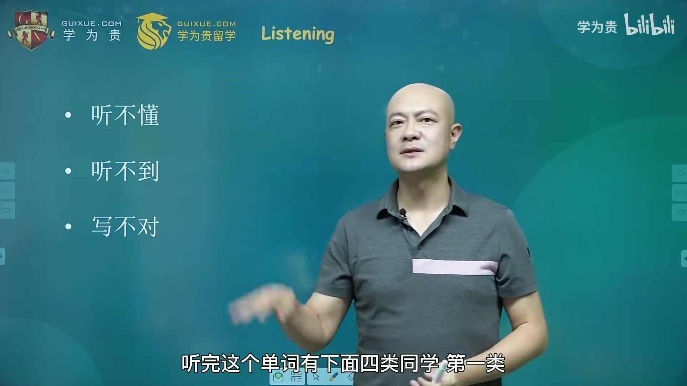
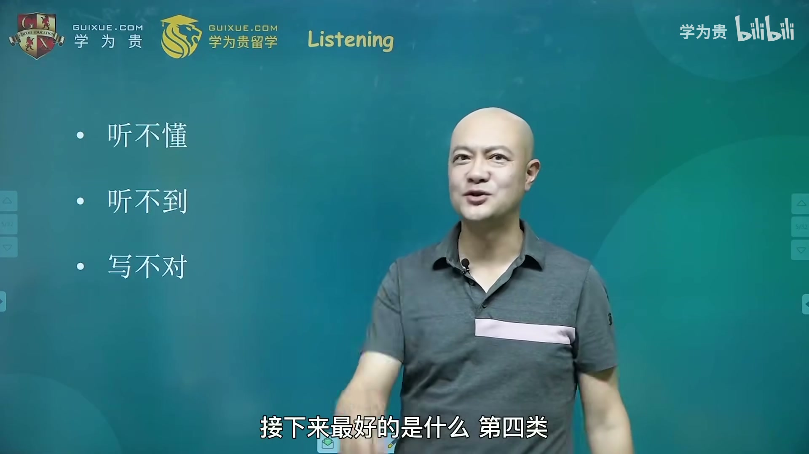
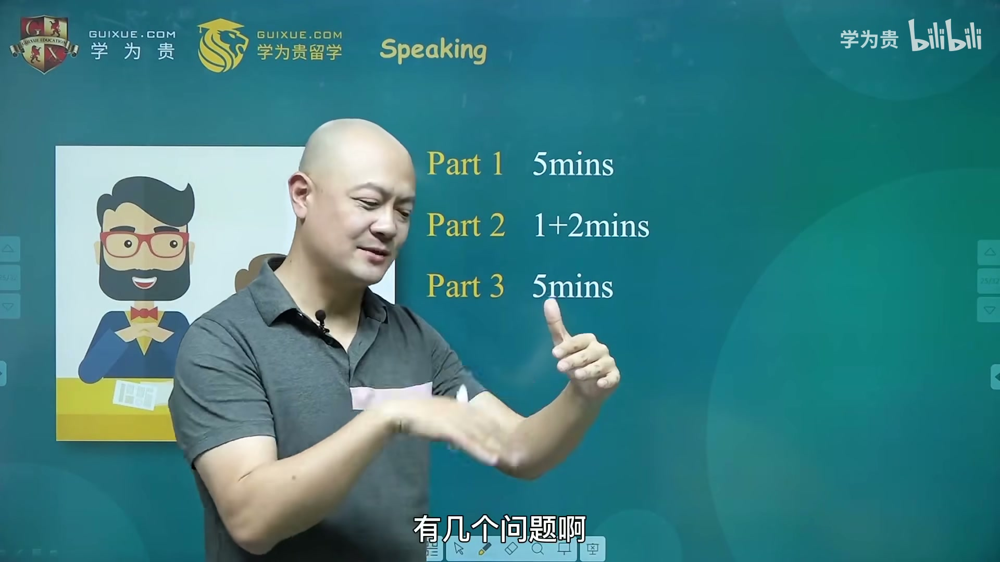
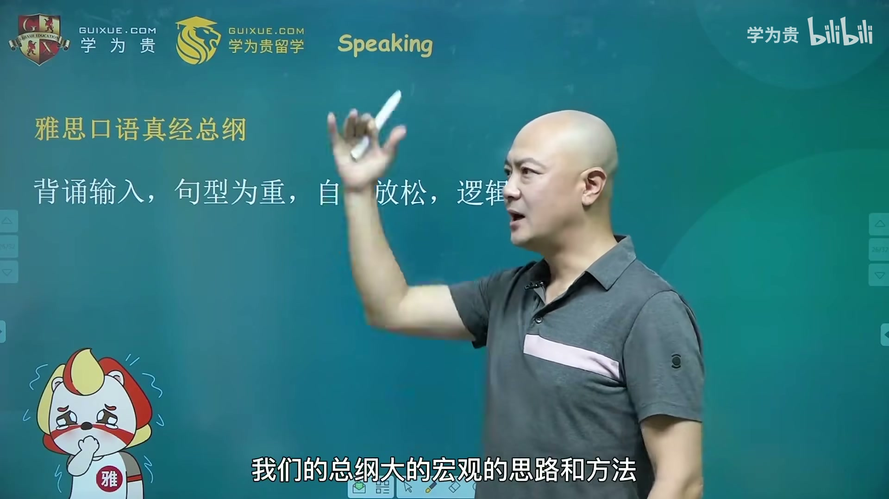

### 5.1 考试形式与结构
*   **一对一的真人访谈**（face to face）。考前建议先找外教聊一聊、找找感觉，因为很多考生不适应西方人"直勾勾看着你"的交流方式，心理压力大。
*   **Part 1**（5 分钟）：general questions，生活寒暄——"你是学生还是工作了？老家在哪？喜欢什么天气/衣服/音乐？"对应**酒吧里和陌生人破冰聊天的场景**。
*   **Part 2**（卡片独白）：给一张卡片 + 几个问题，**1 分钟思考（可打草稿）+ 2 分钟独白**。对应**课堂做 presentation 的场景**。
*   **Part 3**（5 分钟）：就 Part 2 话题深入互动答辩。对应**课堂展示后教授和同学提问答辩的场景**。
*   示例：Part 2 抽到"最有意义的周末——在哪过的、和谁、怎么过、为什么难忘"；Part 3 考官会追问"过去 10 年中国人过周末的方式有什么变化？什么原因导致的？"

### 5.2 十六字总纲
> **背诵输入，句型为重；自然放松，逻辑沟通。**

口语是 "information output"，没有大量输入就输出不地道。关键问题在于**背什么**——很多人走弯路去背素材、背标准答案，效率极低。

### 5.3 句型为重：一个 4.5 分案例
*   真实案例：一名 4.5 分考生被问 "Please describe a book you read in your childhood"，回答 "The Journey to the West"（《西游记》）——只给了名词，得 4.5 分。
*   要上 6 分，应这样答：**"Well, I can still remember the book which is called The Journey to the West."**
*   **功能句型**：`I can still remember something/somebody...`、`I will never forget something/somebody who...`。
*   它的威力在于**通用性**：无论话题是难忘的老师、家乡的建筑、珍贵的经历、还是电影，一句 "I can still remember..." 都能套上——"句型比素材比标准答案更重要"。
*   老师总结了 **88 个功能句型**（其中高频反复练的就是二三十个），背熟后流利度和语法正确度会大幅提升。

### 5.4 自然放松：心态就是分数
*   把口语考试**当成在酒吧和一位很久没见的外国朋友聊天**，放松、不掩饰英语水平 → 分数 **+0.5**；
*   把它**当成一场紧张的答辩** → 分数 **-1.5**。
*   听不懂要敢问：`I'm sorry, can you say that again?`，或直接问 **`What does ... mean?`**。这是真实交流能力，**不会扣分**。
*   经典案例：考官问 "What do you think about **smog** in Beijing?"，如果没听懂 `smog` 又不问，答成 "Smoking is a bad habit"（答非所问），这次口语不可能及格；正确做法是问清楚 `smog` 的意思（烟 + 雾，空气污染），再展开聊"影响健康、这几年已大力改善"。
*   反面案例：很多人只学会了 "That's a very interesting question" 这个过渡句，说完就没下文了——"很是有趣的话题，但我就是不告诉你"，等于没交流。

### 5.5 肢体语言
*   案例：班上一位卖保险的女同学，回答口语时被评"5.5 分左右很难及格"，但她上次雅思口语考了 **6.5 分**。原因是她说话时"眉飞色舞、每个细胞都会说话，眼睛都会说话"，用**肢体语言弥补了词汇量和语法的不足**，让考官感觉不到她在背，而是"交流能力强"。

### 5.6 口语真经练习卡
*   神器：**50 张卡片**，覆盖雅思史上最高频考题（非最新题，而是高频经典题）。
*   每张卡片正面是题目，配有该话题的高分词汇和功能句型；背面扫码可看王富贵老师的示范视频，可模仿表情和表达。
*   使用方式：考前一个月，每天随身带一张卡片，在公交地铁上翻来覆去练。
*   卡片标语："**Each card will make IELTS less hard.**"

---

## 6. 备考资源与学习计划

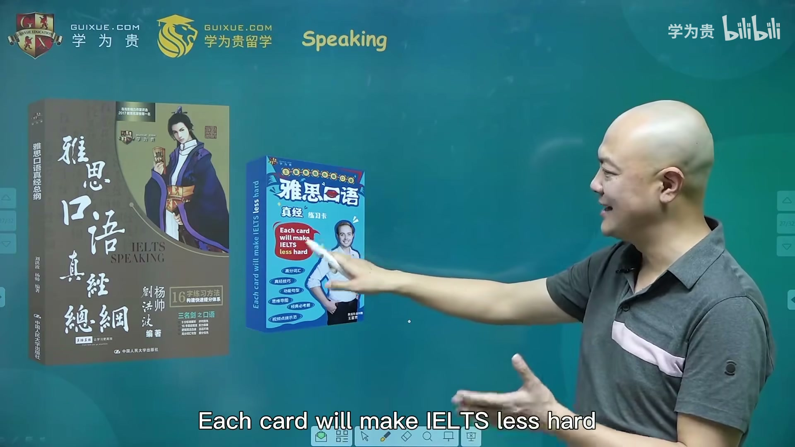
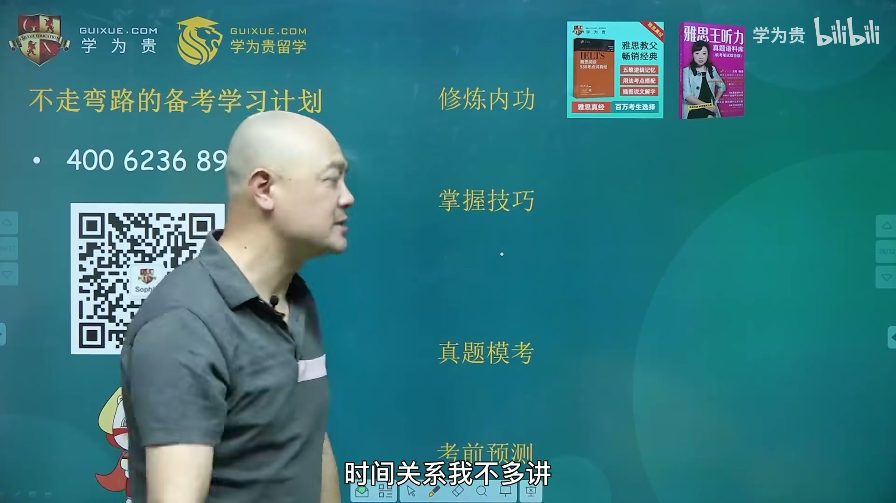

### 6.1 四步自学路线
1.  **修炼内功**：词汇。用逻辑记忆、搭配记忆，而不是乱序 / 从 A 到 Z。
2.  **掌握技巧**：用各科真经的方法论和框架。
3.  **真题模考**：内功技巧都练好后，再模考自测（"找一个水平差不多的对手 pk"）。一上来就模考是没用的。
4.  **考前预测**：针对高频考题做最后冲刺。

### 6.2 八本教材清单
*   **内功（1 本）**：《五维逻辑词汇记忆》
    *   反对乱序记单词，强调**逻辑记忆 + 地道搭配**："不要记 `problem` 是问题，要记 `solve the problem`；不要记 `challenge`，要记 `meet the challenge`。"
    *   按话题成串记忆：运动类（sports → health → circulation 血液循环 → on diet 饮食节制 → immunity 免疫力）；音乐类（music → melody 旋律 → lyrics 歌词 → rhythm 节奏 → catchy lyrics 朗朗上口的歌词 → dynamic rhythm 动感的节奏 → toe-tapper 抖腿神曲）。
    *   好处：词汇在大脑里是"连着"的，考场上碰到一个话题，一串词自动调出；乱序存储则"触及一个点时词汇量出不来"。
    *   配套音频：集团十几位老师（含王富贵）讲解每个单词的用法和趣味点，强调 "usage 更重要，不光是认字"。
*   **技巧（6 本真经）**：
    *   阅读三件套（三明剑）：《雅思阅读真经总纲》（方法）+ 《考点词 538》（词汇）+ 《真经五命中》（考前预测）；
    *   《雅思写作真经总纲》；
    *   《雅思口语真经总纲》；
    *   《雅思听力考点词 179》；
    *   再加王璐老师的《雅思王听力真题语料库》——**一共 8 本**，练完才有资格做真题模考。
*   **考前预测**：学为贵 app 上的"李仙童"组合（李慧芳、李亚山、张天真、杨桐四位老师的组合名），口诀"**有了李仙童，雅思是条虫**"。

### 6.3 课程咨询
*   不想自学：直接拨打 **4000236898** 或扫码加课程顾问，按真经派理念匹配课程（在线班、各地分校都有）。老师提醒："别花 4 万多报班翻来覆去还是 5.5，最后又来找我。"

---

## 观众观点

*   **方法论认可**：大量观众认为刘洪波老师提出的"考点词"、"逻辑记忆法"和"句型为重"的备考思路非常有价值，打破了传统的机械刷题模式。
*   **学习难度讨论**：有观众指出背单词是一个长期积累的过程，建立神经突触结构需要耗费能量，不存在绝对的"简便方法"，对于不同基础的考生，效果可能存在差异。
*   **机构评价**：关于机构的评价呈现两极分化，部分考生表示通过这些方法成功"上岸"，也有评论质疑其商业营销风格。
*   **听力发音争议**：有观众对 `environment` 一词的读音表示好奇，认为其发音与标准英/美音有出入。
