> 来源链接：https://www.bilibili.com/video/BV1r8nMz4EAj/

## 1. 为什么需要 Self-attention

### 1.1 传统模型的局限：输入都是单个向量

李宏毅老师开篇回顾：到目前为止，我们的网络输入都是一个向量——不管是预测 YouTube 观看人数（回归问题，输出一个数值），还是影像处理（分类问题，输出一个类别）。但假设我们遇到**更复杂的问题**：输入是一排向量，而且这排向量的数量（sequence 的长度）每次都会改变。

这与之前讲影像辨识时的假设不同——当时我们特别强调「输入的影像大小都是一样的」。现在输入的长度不固定了，该怎么处理？

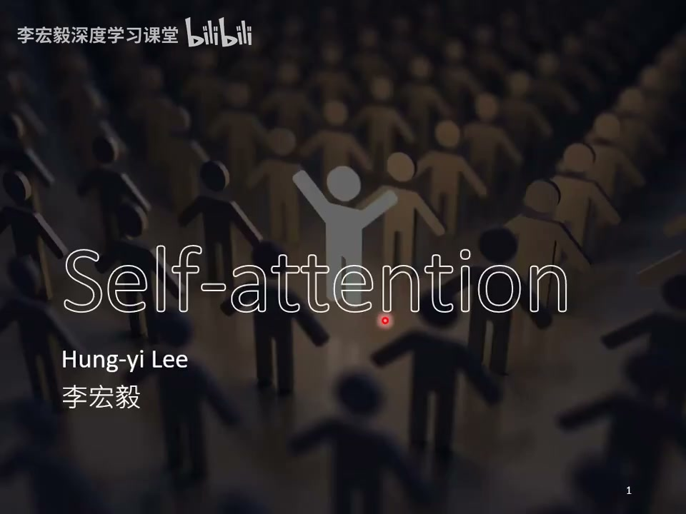

### 1.2 输入为「向量集合」的三个典型场景

**① 文字处理**

- 假设网络输入一个句子，每个句子的长度都不一样、包含的词汇数目都不一样。
- 把一个句子里的每一个词汇都表示成一个向量，那么模型的输入就是一个 **Vector Set**，且这个 Vector Set 的大小随句子长度变化。

那怎么把一个词汇表示成向量？有两种方法：

- **One-hot Encoding（独热编码）**：
  - 开一个很长很长的向量，长度跟世界上存在的词汇数目一样多。假设英文有 10 万个词汇，就要开一个 10 万维的向量，每个维度对应一个词汇：
    - apple = 100
    - bag = 010
    - cat = 001
    - ……
  - **严重问题**：它假设所有词汇彼此之间都没有关系。从这个向量里你看不出「cat 和 dog 都是动物、所以比较接近」，也看不出「cat 和 apple 一个动物一个植物、所以比较不相像」——**这个向量里没有任何语义信息**。
- **Word Embedding（词向量）**：
  - 给每个词汇一个向量，而这个向量**带有语义信息**。
  - 如果把 word embedding 画出来，会发现：所有动物聚集成一团、所有植物聚集成一团、所有动词聚集成一团……
  - word embedding 是怎么得到的，不是本节课重点（有兴趣可以看之前的录影）；总之现在网络上可以直接下载现成的 word embedding。

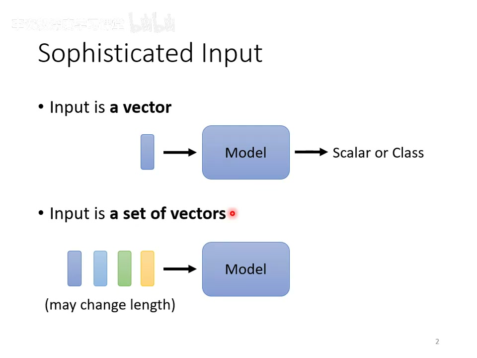
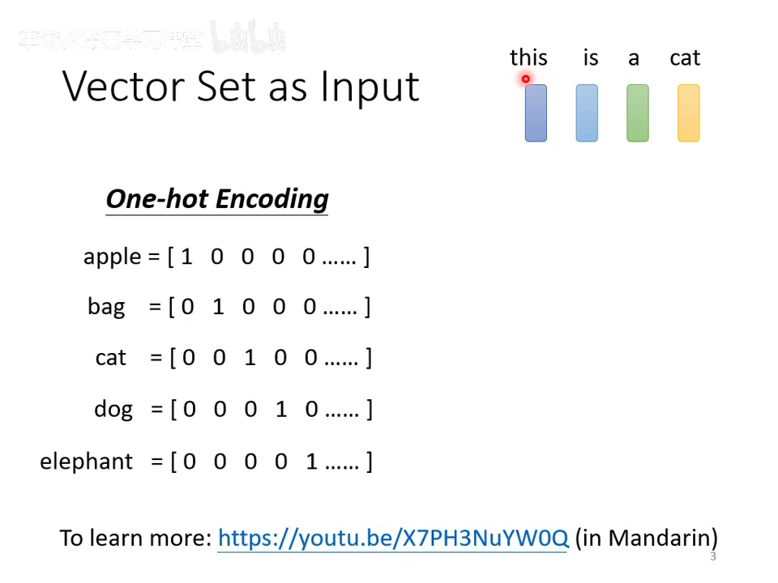

**② 语音识别：一段声音讯号**

- 把一段声音讯号取一个范围，这个范围叫做一个 **Window（窗口）**；把这个 window 里的资讯描述成一个向量，这个向量叫做一个 **Frame（帧）**。
- Window 的长度通常为 **25 毫秒**；为了描述一整段声音讯号，window 会往右移动，通常每次移动 **10 毫秒**。
  - （老师原话调侃：为什么是 25、为什么是 10？这个问题很难回答，是「古圣先贤帮你调好的」——你自己调出来的结果都比较差，古圣先贤已经把所有的可能都试过、调出了最好的结果。）
- 因为每次移动 10ms，所以：**1 秒钟的声音讯号 = 100 个向量，1 分钟 = 6000 个向量**。
- 结论：语音其实很复杂，一小段声音讯号里包含的资讯量非常可观，所以声音讯号也是一堆向量。

**③ 图结构（Graph）**

- **社交网络**：social network 就是一个 graph。每个节点是一个人，节点之间的边代表「是不是朋友」等关系。每个节点可以看作一个向量——拿每个人的 profile 资讯（性别、年龄、职业、讲过的话……）用一个向量表示。这样一个 social network 就可以看作是一堆向量组成的。
- **分子**：一个分子也可以看作一个 graph，分子上的每一个球就是一个原子（一个向量）。原子可以用 one-hot 向量表示：氢 = 100、碳 = 0100、氧 = 0010。一个分子就是一个 graph、就是一堆向量。
  - 应用背景：**药物发现（drug discovery）** 非常受重视，尤其 COVID-19 期间，很多人期待机器学习在药物发现上取得突破，这时就需要把分子当作模型的输入。

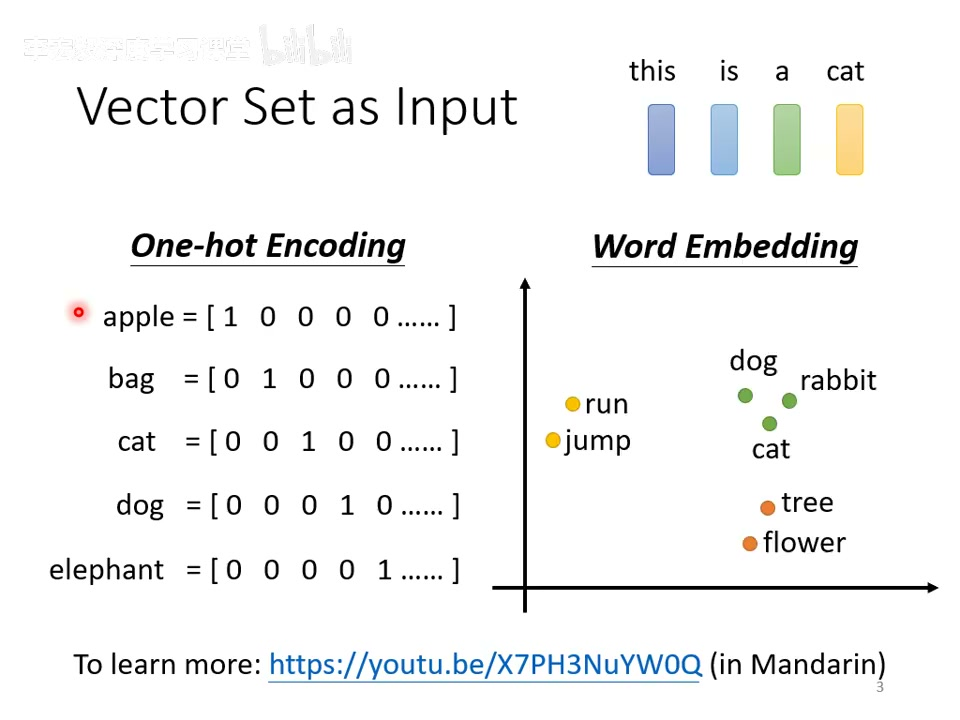

## 2. 输出的三种类型

输入是一堆向量（可以是文字、语音、Graph），输出可能有三种可能性。

### 2.1 类型一：每个向量都有一个对应的 Label（Sequence Labeling）

- 当模型看到输入是 4 个向量时，就输出 4 个 label。每个 label 可以是数值（回归问题）或类别（分类问题）。
- 输入跟输出长度一样，所以**模型不需要烦恼要输出多少个 label**——输入 4 个就输出 4 个，输入 5 个就输出 5 个。
- 典型应用：
  - **词性标注（POS tagging）**：让机器自动决定每个词汇是什么词性（名词/动词/形容词……）。这个任务并不容易，例如句子 **"I saw a saw"**（这不是打错）：第二个 saw 当名词用，是「可以锯东西的句子（锯子）」。机器要知道第一个 saw 是动词、第二个 saw 是名词，但每个输入的词汇都要有一个对应的词性输出。
  - **语音（作业二）**：一段声音讯号里有一串 vector，每个 vector 要判断属于哪一个音素（音标）——注意这不是真正的语音辨识，而是简化版。
  - **社交网络**：给一个 graph，模型决定每个节点有什么特性，比如他会不会买某个商品，从而决定要不要推荐商品给他。

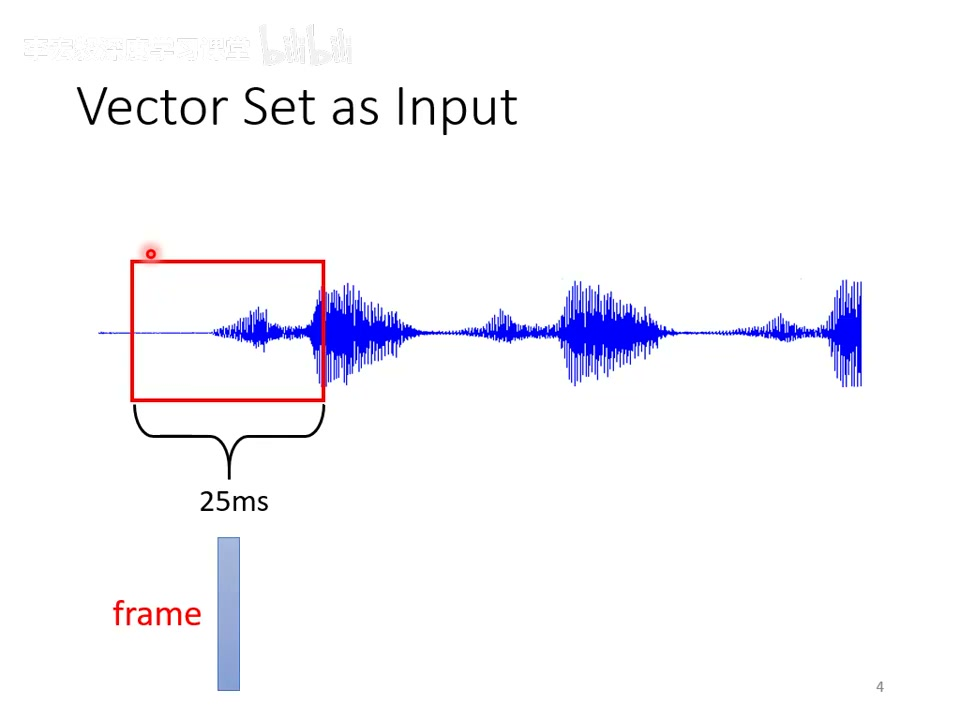

### 2.2 类型二：整段序列只输出一个 Label

- 给机器一整个 sequence，只需要输出一个 label。
- 典型应用：
  - **情感分析（Sentiment Analysis）**：给机器看一段话，决定它是正面的还是负面的。应用场景很有用：你的公司开发的产品上线后，想知道网友评价，又不可能一则一则留言分析，就可以用 sentiment analysis 自动判读——当一则贴文提到某个产品时，它是正面还是负面。
  - **语音（作业四）**：说话人辨认（Speaker Recognition），听一段声音决定它是谁讲的。
  - **图**：给一个分子，预测它有没有毒性、亲水性如何——给一个 graph 输出一个 label。

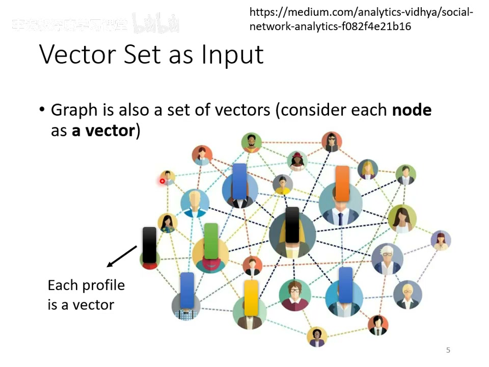

### 2.3 类型三：输出长度由模型自己决定（Sequence-to-Sequence）

- 我们不知道应该输出多少个 label，机器要自己决定输出多少个：输入 N 个向量，输出可能是 N' 个 label。
- 这种任务叫 **Sequence-to-Sequence**。例如：
  - **机器翻译**：输入输出是不同语言，词汇数目本来就不会一样多。
  - **真正的语音辨识**：输入一句话，输出一段文字。
- 这节课之后会讲类型三，**今天只讲第一种类型（sequence labeling，输入输出数目一样多）**。

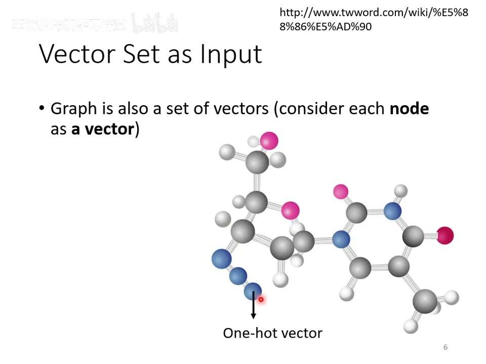

## 3. Sequence Labeling 的挑战与解决方案

### 3.1 最直觉的做法：FCN「各个击破」

- 直觉想法（跟作业二一样）：用全连接网络（Fully Connected Network, FCN），虽然输入是一个 sequence，但「各个击破，不要管它是不是一个 sequence」，把每个向量分别输入 FCN，产生对应的输出。
- **但这么做有非常大的瑕疵**：以词性标注为例，给机器句子 "I saw a saw"。对 FCN 来说，两个 saw 完全一模一样、是同一个词汇，输入同一个词汇没有理由输出不同的东西。但实际期望第一个 saw 输出动词、第二个 saw 输出名词。网络会「非常困惑，完全不知道要怎么处理」。

### 3.2 改进：Windowing（窗口，引入上下文）

- 有没有可能让 FCN 考虑更多上下文的资讯？可以——把这个向量**前后几个向量都串起来**，一起丢进 FCN。
- 事实上作业二助教已经这么做了：不是只看一个 frame 判断它属于哪一个音标，而是**看这个 frame 前面 5 个 + 后面 5 个，总共 11 个 frame**。
- 但这种方法还是有极限：
  - 作业二用窗口就够好了。就算给你整个 sequence 的资讯、考虑整个 sequence，也可能很难做得更好——作业二看前后 5 个 frame 就能得到很不错的结果。要过 strong baseline，重点不在于考虑整个 sequence。
  - **真正的问题**：如果某个任务不是考虑一个 window 就能解决，而是必须考虑一整个 sequence 才能解决呢？有人会说「把 window 开大一点，大到盖住整个 sequence 不就结束了」。但 sequence 的长度有长有短，要开一个比训练资料里最长 sequence 还长的 window，意味着 FCN **需要非常多的参数**——不仅运算量很大，还容易**过拟合（overfitting）**。

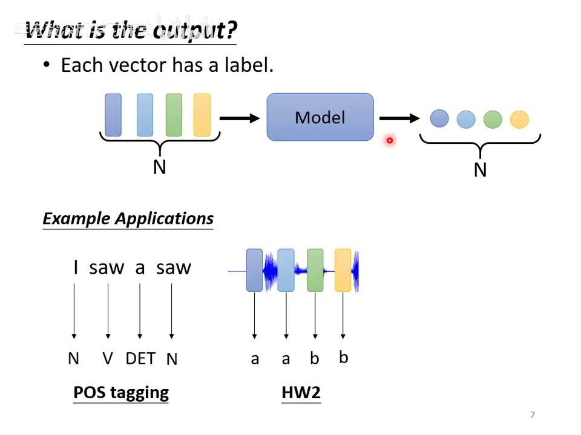
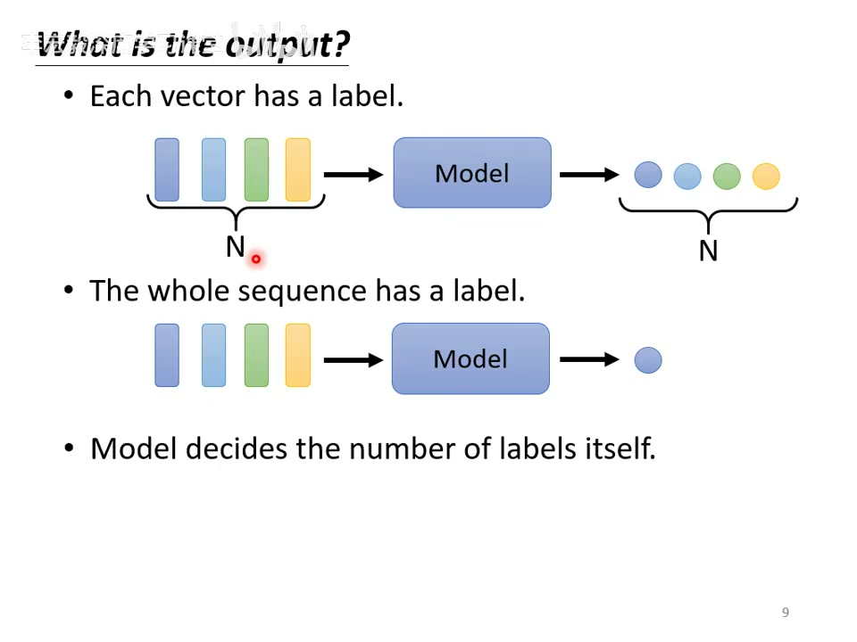
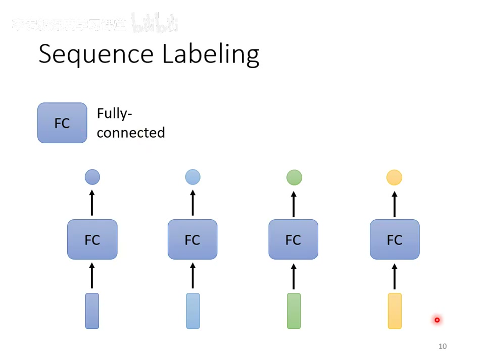

## 4. Self-attention 机制

### 4.1 总体运作方式

- **Self-attention 会吃一整个 sequence 的资讯**：输入几个向量，就输出几个向量（比如输入 4 个向量，就 output 4 个向量）。
- 输出的每个向量**都是考虑了整个 sequence 以后才得到的**（图中每个输出向量特意画了黑色框框，代表它不是普通向量，而是考虑了整个句子的资讯）。
- 再把「考虑过整个句子的向量」丢进 FCN 来决定它的类别或数值——如此一来，FCN 就不是只考虑一个很小的范围或小窗口，而是**基于整个 sequence 的资讯来输出结果**。

### 4.2 Self-attention 与 FCN 交替使用、可以叠加

- self-attention 不是只能用一次，可以叠加很多次：
  - self-attention → FCN → self-attention → FCN → ……交替堆叠。
  - **self-attention 处理整个 sequence 的资讯；FCN 专注于处理某一个位置的资讯**。
  - 然后可以再用 self-attention 把整个 sequence 的资讯再处理一次，交替使用。

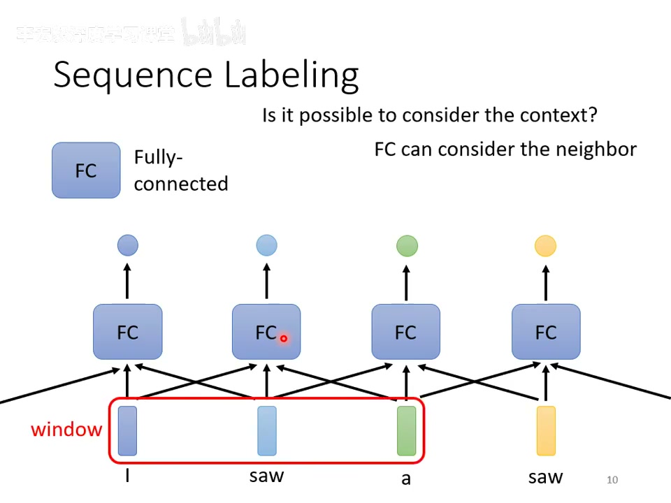
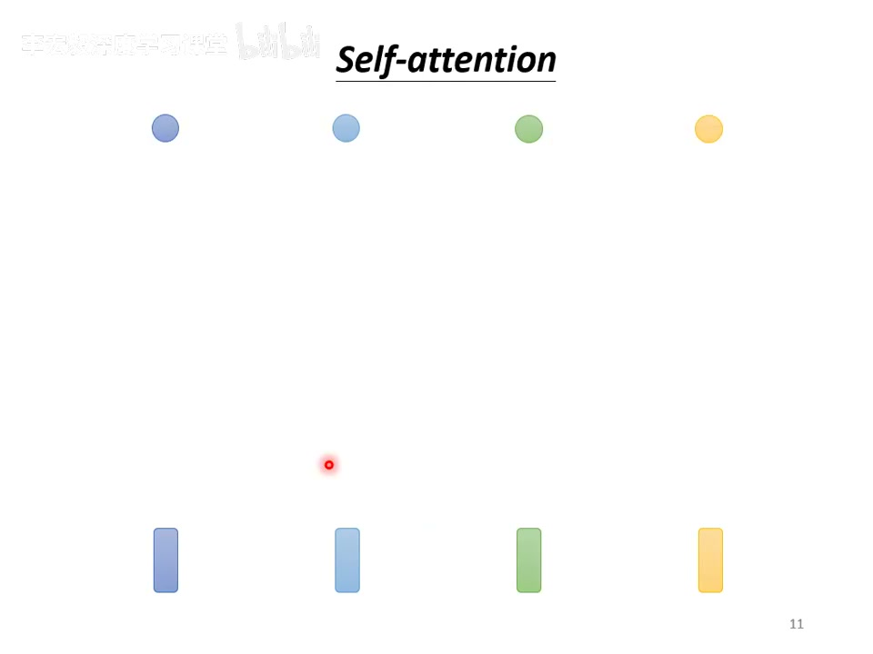

### 4.3 相关论文：Attention is All You Need（Transformer）

- 关于 self-attention 最知名的文章是 **《Attention is All You Need》**，Google 在这篇 paper 里提出了 **Transformer** 网络架构。
- Transformer 就是「变形金刚」——提到这个网络，我们就会有变形金刚的形象。在 Transformer 里一个最重要的 module 就是 self-attention，它**就是变形金刚的火种源**。
- 老师吐槽：这篇 paper 最厉害的地方是它有个霸气的名字（Attention is All You Need）。实际上很多更早的 paper 就提出过类似的架构（只是不见得叫 self-attention，比如叫 self-match 之类），是这篇 paper 把 self-attention 这个「麻球」发扬光大。

### 4.4 输入输出的表示

- self-attention 的输入是一串向量，**用 $A$ 表示而不用 $X$**：因为它可能是整个网络的输入，也可能是某个 hidden layer 的输出（前面已经做过一些处理）。
- 输入一排 $A$ 以后，self-attention 输出另一排向量 $B$。每一个 $B^i$ 都是**考虑了所有 $A$ 之后才生成**的——图上画了非常多的箭头，告诉你 $b^2$ 考虑了 $a^1$ 到 $a^4$，$b^3$、$b^4$ 也一样，都考虑了整个 input sequence。

### 4.5 生成 $b^1$ 的计算过程（核心，讲透）

只要知道怎么产生 $b^1$，就知道怎么产生剩下的 $b^2, b^3, b^4$。

**Step 1：找出与 $a^1$ 相关的其他向量**

- 做 self-attention 的目的是考虑整个 sequence，但我们又不希望把整个 sequence 的资讯包在一个 window 里。所以有一个**特别的机制**：根据 $a^1$，找出整个很长的 sequence 里「哪些部分是重要的」——哪些部分跟判断 $a^1$ 是哪一个 label / 决定 $a^1$ 的类别或回归数值有关。
- 每个向量跟 $a^1$ 的关联程度用一个数值 **$\alpha$** 表示。

**Step 2：计算关联性 $\alpha$ 的两种方法**

- 需要有一个「计算 attention 的模组」：拿两个向量作为输入，直接输出 $\alpha$ 这个数值，当作两个向量的关联程度。做法有非常多，常见的有两种：

- **方法一：Dot-product（点积，最常用，Transformer 用的方法）**
  - 把输入的两个向量分别乘上两个不同的矩阵：左边乘上 $W^q$，右边乘上 $W^k$，得到 $q$ 和 $k$ 两个向量。
  - 再把 $q$ 和 $k$ 做点积（element-wise 相乘再全部加起来），得到一个标量（scalar），就是 $\alpha$。

- **方法二：Additive（加性）**
  - 同样通过 $W^q, W^k$ 得到 $q$ 和 $k$，但不是做点积，而是把两个向量**串起来**，丢过一个激活函数（activation function），再经过一个 transform，得到 $\alpha$。

- 接下来的讨论里都只用**点积方法**（也是目前最常用、用在 Transformer 里的方法）。

**Step 3：套用到 sequence——Query / Key / Value**

- 把 $a^1$ 乘上 $W^q$ 得到 $q^1$。**$q$ 叫做 Query（查询）**——就像搜索引擎里搜索相关文章时的关键词。
- 把 $a^2, a^3, a^4$ 分别乘上 $W^k$ 得到 $k^2, k^3, k^4$。**$k$ 叫做 Key（键）**。
- 用 query 和每个 key 做点积，得到 attention score（注意 $\alpha_{i,j}$ 的下标表示 query 由 $i$ 提供、key 由 $j$ 提供）：
  - $\alpha_{1,2} = q^1 \cdot k^2$（$a^1$ 与 $a^2$ 的关联性）
  - $\alpha_{1,3} = q^1 \cdot k^3$
  - $\alpha_{1,4} = q^1 \cdot k^4$
- 一般实做时，$q^1$ 也会跟**自己**算关联性：把 $a^1$ 也乘上 $W^k$ 得到 $k^1$，再算 $\alpha_{1,1}$。「自己跟自己算关联性有多重要？你可以自己在做作业的时候试试看。」

**Step 4：Softmax 归一化**

- 计算出 $a^1$ 跟每个向量的关联性以后，会做一次 **Softmax**（和分类时的 softmax 一模一样）：把所有 $\alpha$ 全部取 exponential，再把 exponential 的值全部加起来做 normalize，得到 $\alpha'$：

$$\alpha'_{1,i} = \frac{\exp(\alpha_{1,i})}{\sum_{j} \exp(\alpha_{1,j})}$$

- 这里**不一定非要 softmax**。老师原话：「这边就没有什么道理，你们不一定要用 softmax，可以用别的东西也没问题。」比如有人尝试过全部用 ReLU，结果发现还比 softmax 好一点。softmax 只是最常见的，你可以自己试试能不能试出更好的结果。

**Step 5：抽取信息（加权求和）**

- 根据 $\alpha'$ 我们知道了哪些向量跟 $a^1$ 最有关系。接下来**根据 attention score 抽取重要的资讯**：
  - 把 $a^1$ 到 $a^4$ 每一个向量乘上 $W^v$，得到新的向量 $v^1, v^2, v^3, v^4$（**$v$ 叫做 Value**）。
  - 把每个 $v^i$ 都乘上对应的 attention score $\alpha'_{1,i}$，再全部加起来，得到 $b^1$：

$$b^1 = \sum_{i} \alpha'_{1,i}\, v^i$$

- **直观理解**：哪个向量得到的 attention score 越高，它的 $v$ 就越「主导」抽取出来的结果。例如如果 $a^1$ 与 $a^2$ 的关联性很强、$\alpha'_{1,2}$ 的值很大，那么做加权求和以后，$b^1$ 的值就可能会比较接近 $v^2$。

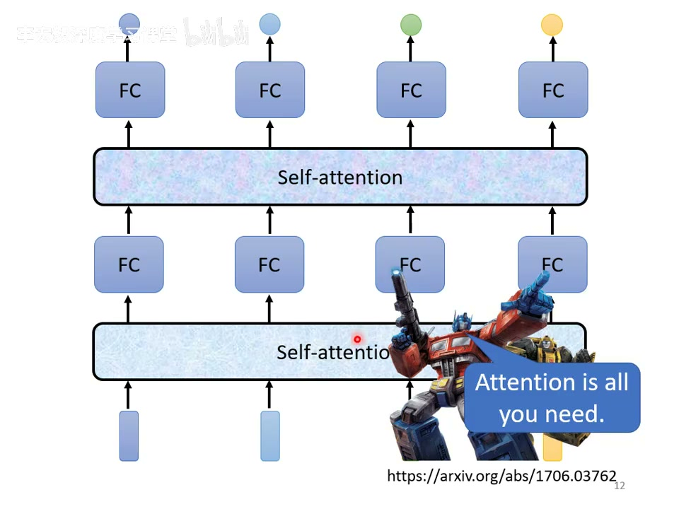
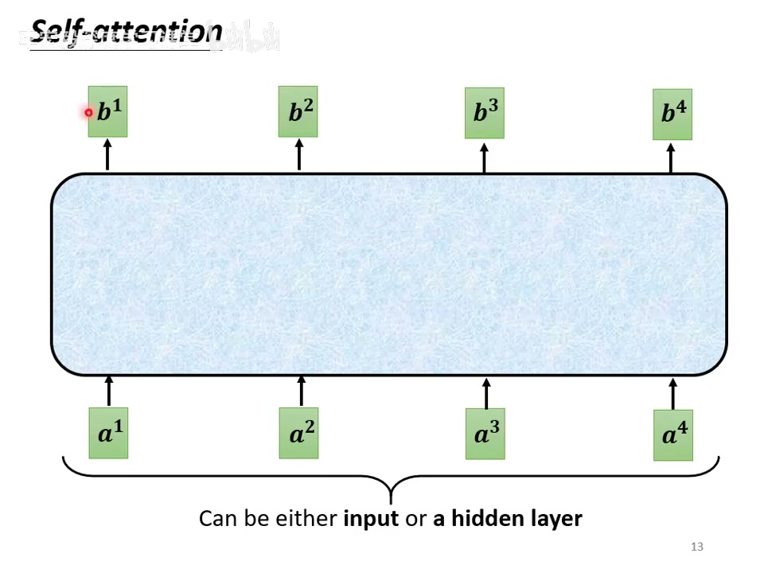
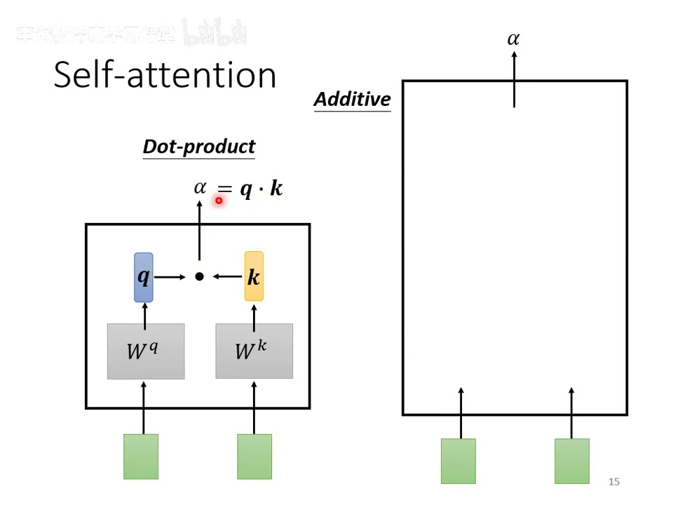
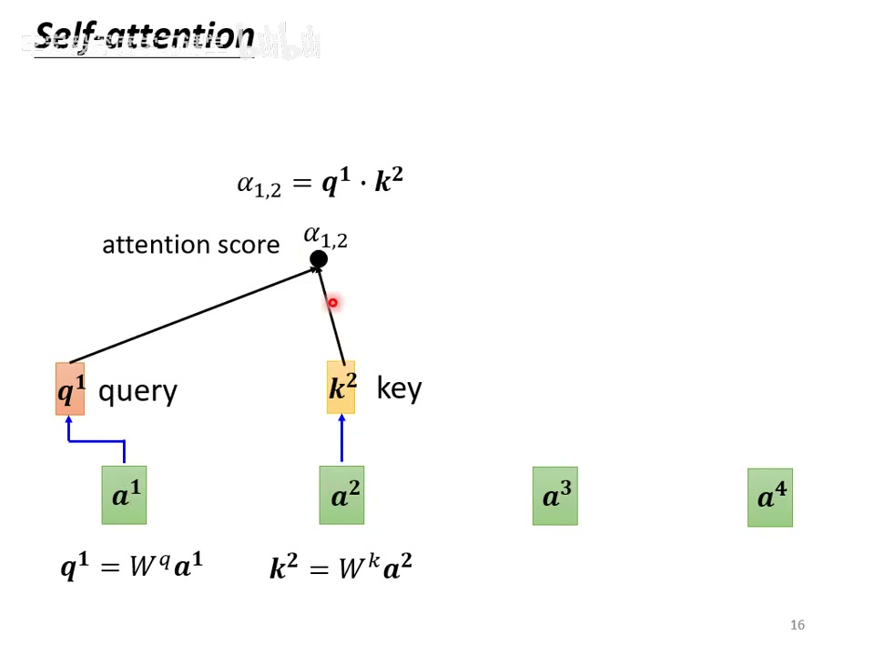
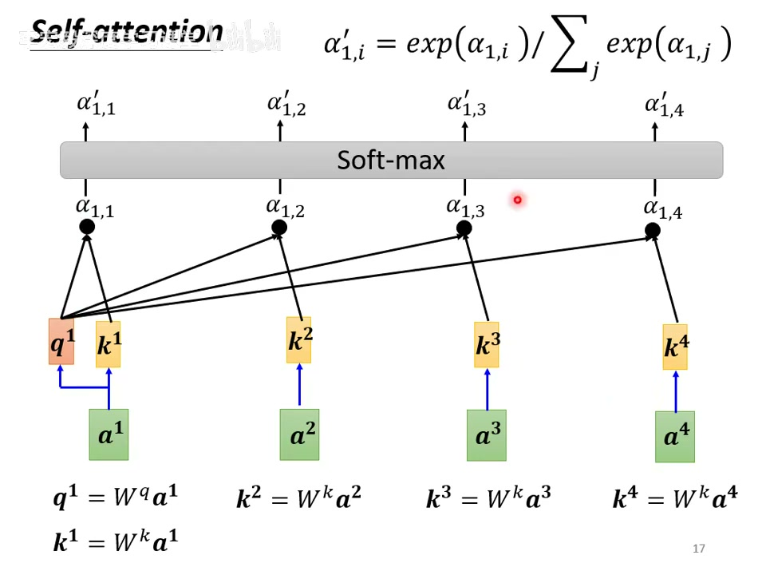
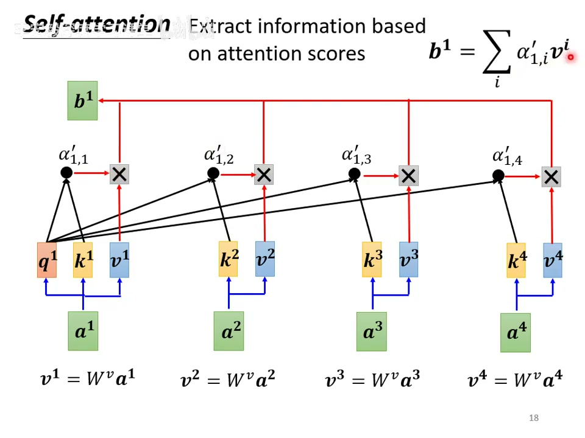

## 5. 观众观点

*   **核心优势**：观众指出 Self-attention 与 RNN 的主要区别在于并行计算能力，RNN 需要逐个传递数据，而 Self-attention 可以一次性处理。
*   **对比 CNN**：CNN 可被视为感受野（Receptive Field）受限的 Self-attention。
*   **图神经网络应用**：在 Graph 中使用 Self-attention 时，通常只关注有边连接的节点，利用领域知识减少无关计算。
*   **学习建议**：多位观众推荐先看李宏毅老师的视频入门，后续配合李沐老师的进阶讲解，并强调一定要动手实现代码，因为原理与实现细节存在差异。
*   **补充资料**：李宏毅老师提供相关课件与代码，可关注公众号【AI评论员】回复【079】获取。
